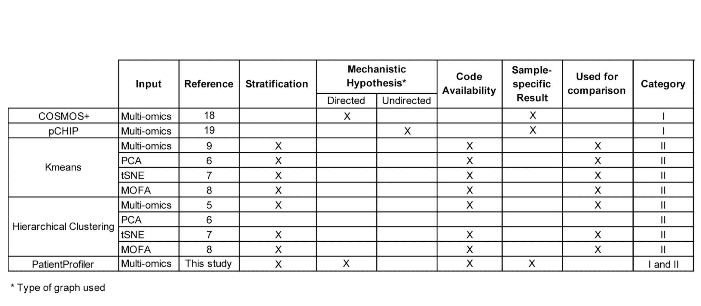
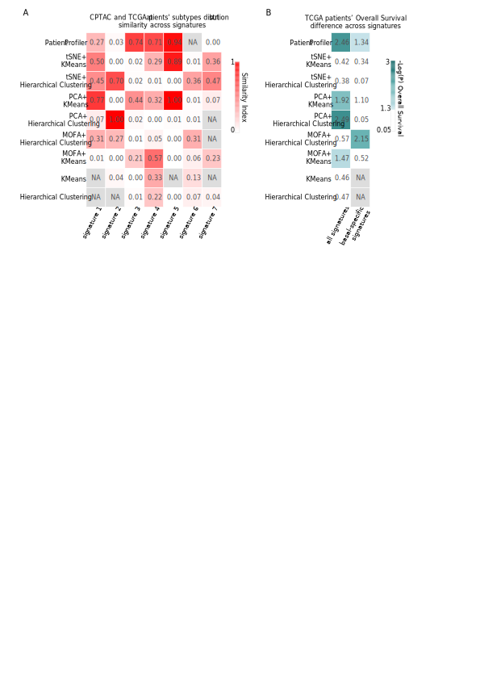

## Comparison strategy

-  We exploited multi-omic data(transcriptomics and (phospho)proteomics) relative to the cohort of 122 Breast cancer patients from CPTAC; 
-  In parallel, we retrieved transcriptomic and clinical data relative to the cohort of 1,094 Breast cancer patients from The Cancer Genome Atlas (TCGA); 
-  For each tool in the comparison:
      -  we used multi-omic data from CPTAC as input to stratify patients in seven subgroups;
      -  and to generate seven transcriptomic signatures representative of each subgroup; 
      -  transcriptomic signatures from each tool were used in combination with TCGA-derived transcriptomic data in a gene set enrichment analysis (GSEA) to stratify TCGA patients, accordingly and to derive subgroups (Adjusted P-value < 0.01, NES > 0); 
      -  for each tool, we performed a survival analysis to detect significant differences in overall survival (OS) between the subgroups enriched by the transcriptomic signatures in TCGA and for each signature we compared subtype composition of the groups in CPTAC and TCGA identified by the same signature; 




```{r setup, eval = TRUE, include=FALSE}

knitr::opts_chunk$set(echo = TRUE, warning = FALSE, message = FALSE)
source('0.libraries.R')
```


###  Load Data

```{r load data, eval=FALSE}

# Load Clinical Data

clinical_dataframe = read_tsv("../Step1/clinical_dataframe.tsv")
rownames(clinical_dataframe) <- clinical_dataframe$Name 
clinical_dataframe.T <- as.data.frame(t(clinical_dataframe)) 
clinical_dataframe.T <- clinical_dataframe.T[-c(1), ,]
clinical_dataframe.T <- as.data.frame(clinical_dataframe.T[, c(5,8)])
clinical_dataframe.T$patient_ID <- rownames(clinical_dataframe.T)
clinical_data <- clinical_dataframe.T %>% select(patient_ID, NMF.Cluster)

# Load Multi-omics Data

# Proteomics
proteomics_patients_w <- read_tsv('../Step1/Proteomics_updated.tsv')
p_data <- proteomics_patients_w 
p_data$UNIPROT <- NULL
rownames_p <- paste0('P_', p_data$gene_name)
p_data$gene_name <- NULL
p_data <- t(p_data)
colnames(p_data) <- rownames_p

# Phosphoproteomics
PHproteomics_patients_w <- read_tsv('../Step1/Phosphoproteomics_updated.tsv')
rownames_ph <- paste0('Ph_', PHproteomics_patients_w$gene_name, '_',
                      PHproteomics_patients_w$amminoacid,
                      PHproteomics_patients_w$position)
ph_data <- PHproteomics_patients_w
ph_data$gene_name <- NULL
ph_data$UNIPROT <- NULL
ph_data$sequence_window <- NULL
ph_data$amminoacid <- NULL
ph_data$position <- NULL
ph_data <- t(ph_data)
colnames(ph_data) <- rownames_ph

# Transcriptomics
transcriptomics_patients_w <- read_tsv('../Step1/Transcriptomics_updated.tsv')
t_data <- transcriptomics_patients_w
rownames_t <- paste0('T_', t_data$gene_name)
t_data$gene_name <- NULL
t_data <- t(t_data)
colnames(t_data) <- rownames_t

# Combine all omics data
merged_data <- cbind(t_data, p_data, ph_data)
data_scaled <- scale(merged_data)  # Standardize data

```

### Try alternative clustering methods

- KMeans: 
  - KMeans + Multi-omics
  - KMeans + PCA
  - KMeans + tSNE
  - KMeans + MOFA
  
- Hierarchical clustering: 
  - Hierarchical clustering + Multi-omics
  - Hierarchical clustering + PCA
  - Hierarchical clustering + tSNE
  - Hierarchical clustering + MOFA 
  

```{r find clusters, eval = FALSE}

####### KMeans + PCA

# PCA
pca_result <- prcomp(data_scaled, center = TRUE, scale. = TRUE)
pca_data <- as.data.frame(pca_result$x[, 1:2]) %>% 
  dplyr::rename(PCA1 = PC1, PCA2 = PC2)

# KMeans on PCA
set.seed(42)
kmeans_pca <- kmeans(pca_data, centers = 7)
pca_data$PCA_Cluster_KMeans <- as.factor(kmeans_pca$cluster)


####### Hierarchical clustering + PCA

hc_pca <- hclust(dist(pca_data), method = "ward.D2")
pca_data$PCA_Cluster_HC <- as.factor(cutree(hc_pca, k = 7))


####### KMeans + tSNE

# t-SNE
tsne_result <- Rtsne(data_scaled, dims = 2, perplexity = 30, verbose = TRUE)
tsne_data <- as.data.frame(tsne_result$Y) %>% 
  dplyr::rename(tSNE1 = V1, tSNE2 = V2)

# KMeans on t-SNE
set.seed(42)
kmeans_tsne <- kmeans(tsne_data, centers = 7)
tsne_data$tSNE_Cluster_KMeans <- as.factor(kmeans_tsne$cluster)

####### Hierarchical clustering + tSNE

hc_tsne <- hclust(dist(tsne_data), method = "ward.D2")
tsne_data$tSNE_Cluster_HC <- as.factor(cutree(hc_tsne, k = 7))

####### KMeans + Multi-omics

kmeans_result <- kmeans(data_scaled, centers = 7, nstart = 25)

####### Hierarchical clustering + Multi-omics

hc_result <- hclust(dist(data_scaled), method = "ward.D2")


# Compile Final Clustering Results

final_df <- data.frame(
  patient_ID = rownames(data_scaled),
  KMeans_Cluster = kmeans_result$cluster,
  HC_Cluster = cutree(hc_result, k = 7),
  PCA_Cluster_KMeans = pca_data$PCA_Cluster_KMeans,
  PCA_Cluster_HC = pca_data$PCA_Cluster_HC,
  tSNE_Cluster_KMeans = tsne_data$tSNE_Cluster_KMeans,
  tSNE_Cluster_HC = tsne_data$tSNE_Cluster_HC
) %>%
  left_join(clinical_data, by = "patient_ID")

####### KMeans + MOFA and Hierarchical clustering + MOFA

# Prepare MOFA inputs
phospho_m <- PHproteomics_patients_w %>% 
  mutate(key = paste0(gene_name, '-', amminoacid, position)) %>% 
  select(-gene_name, -amminoacid, -UNIPROT, -position, -sequence_window) %>% 
  relocate(key) %>% 
  column_to_rownames('key') 

prot_m <- proteomics_patients_w %>% 
  select(-UNIPROT) %>% 
  distinct(gene_name, .keep_all = TRUE) %>% 
  column_to_rownames('gene_name') 

rnaseq_m <- transcriptomics_patients_w %>% 
  column_to_rownames('gene_name')

data <- list(t_data = as.matrix(rnaseq_m),
             p_data = as.matrix(prot_m),
             ph_data = as.matrix(phospho_m))

# Build and train MOFA model
MOFAobject <- create_mofa(data)
data_opts <- get_default_data_options(MOFAobject)
model_opts <- get_default_model_options(MOFAobject)
train_opts <- get_default_training_options(MOFAobject)

MOFAobject <- prepare_mofa(MOFAobject, data_opts, model_opts, train_opts)
outfile = file.path(getwd(), "model.hdf5")
MOFAobject.trained <- run_mofa(MOFAobject, outfile, use_basilisk = TRUE)

# Load and cluster MOFA factors
model <- load_model('./model.hdf5')
factor_scores <- get_factors(model)$group1

# KMeans on MOFA
set.seed(123)
kmeans_result <- kmeans(factor_scores, centers = 7, nstart = 25)
factor_df <- as_tibble(factor_scores)
factor_df$Cluster <- kmeans_result$cluster

patients_groups <- tibble(
  patients_ID = names(kmeans_result$cluster),
  clusters = kmeans_result$cluster
)
write_tsv(patients_groups, './mofa_kmeans_groups.tsv')

# Hierarchical clustering on MOFA
factors_table <- as_tibble(factor_scores)
factors_table$patients <- NULL
dist_hc <- dist(factors_table)
hc_mofa <- hclust(dist_hc, method = "ward.D2")
mofa_hc <- tibble(patient_ID = patients_groups$patients_ID, 
                  signature = as.factor(cutree(hc_mofa, k = 7)))
write_tsv(mofa_hc, './mofa_hc_clusters.tsv')

# Merge MOFA clustering with previous results
colnames(mofa_hc)[2] <- 'Mofa_HC'
colnames(patients_groups)[2] <- 'Mofa_KMeans'

merged_mofa <- final_df %>%
  inner_join(mofa_hc, by = 'patient_ID') %>%
  inner_join(patients_groups, by = c('patient_ID' = 'patients_ID'))

write_xlsx(merged_mofa, './alternative_clustering.xlsx')


```


### PatientProfiler  

```{r patientprofiler, eval = FALSE}

####### PatientProfiler

# Add CPTAC PatientProfiler result
merged_mofa <-read_xlsx("alternative_clustering.xlsx")

cptac_sign <- merged_mofa %>% relocate(patient_ID, NMF.Cluster)
colnames(cptac_sign) <- c('patient_ID', 'subtype', 'kmeans', 'HC', 'pca_kmeans', 'pca_hc', 'tsne_kmeans', 'tsne_hc', 'mofa_kmeans', 'mofa_hc')

cptac_pp <- readxl::read_excel('../Step5/Table_3.xlsx', sheet = 1)
cptac_pp$Signature <- str_remove_all(cptac_pp$Signature , 'Signature_')
cptac_pp$Subtype <- NULL
colnames(cptac_pp)[2] <- 'patientprofiler'

cptac_sign_pp <- left_join(cptac_sign, cptac_pp, by = 'patient_ID')
write_tsv(cptac_sign_pp, './cptac_results.tsv')

# Add TCGA PatientProfiler result

list.files('./tcga/') -> files_tcga
methods <- c('HC', 'kmeans', 'mofa_hc', 'mofa_kmeans', 'pca_hc', 'pca_kmeans', 'tsne_hc', 'tsne_kmeans')
i <- 1
for(file_tcga in files_tcga){
  df_single <- read_tsv(paste0('./tcga/', file_tcga)) 
  df_single$group <- str_remove_all(df_single$group, 'CL')
  if(i == 1){
    df_all <- df_single %>% select(patient_ID, subtype, group)
    colnames(df_all)[3] <- methods[i]
  } else {
    df_single <- df_single %>% select(patient_ID, group)
    colnames(df_single)[2] <- methods[i]
    df_all <- inner_join(df_all, df_single, by = 'patient_ID')
  }
  i <- i + 1
}

tcga_pp <- readxl::read_excel('../Step5/Table_3.xlsx', sheet = 2)
tcga_pp$Signature <- str_remove_all(tcga_pp$Signature , 'Signature')
tcga_pp$Subtype <- NULL
colnames(tcga_pp)[2] <- 'patientprofiler'

df_all <- left_join(df_all, tcga_pp, by = 'patient_ID')
write_tsv(df_all, './tcga_results.tsv')

```


### Anova
This analysis aims to identify genes whose expression levels significantly differ across patient subgroups defined by various clustering algorithms. By applying ANOVA, we assess whether the stratification of patients—based on transcriptomic data and unsupervised clustering—correlates with distinct gene expression patterns.

```{r anova, eval = FALSE}

# Read in the clustering results and select relevant columns
result_df_alternative <- read_tsv('cptac_results.tsv') %>%
  dplyr::select(patient_ID, 
                kmeans,
                HC,
                pca_kmeans,
                pca_hc,
                tsne_kmeans,
                tsne_hc, 
                mofa_kmeans, 
                mofa_hc)

# List of clustering methods
method_names <- colnames(result_df_alternative)[2:9]

# Loop through each clustering method
for (method_name in method_names) {
  # Create a directory to save results
  dir.create(method_name, showWarnings = FALSE)  
  
  # Load transcriptomics data and reshape it to long format
  Transcriptomics_patients_temp <- read_tsv("../Step1/Transcriptomics_updated.tsv") %>%
    pivot_longer(cols = -gene_name, names_to = "patient_ID", values_to = "value")
  
  # Create a stratification table with patient IDs and their cluster assignment
  stratification_table <- result_df_alternative %>%
    dplyr::select(patient_ID, community = all_of(method_name))
  
  # Add the "community" (cluster) column to the transcriptomics data
  Transcriptomics_patients_temp <- left_join(Transcriptomics_patients_temp, stratification_table, by = 'patient_ID')
  
  # Perform ANOVA to compare gene expression across clusters
  final_results <- PatientProfiler::perform_anova(Transcriptomics_patients_temp, stratification_table)
  
  # Save the ANOVA results to an Excel file
  output_path <- file.path(method_name, paste0(method_name, '_result.xlsx'))
  writexl::write_xlsx(final_results, output_path)
}
```


### Find signatures
This analysis aims to identify molecular signatures—sets of genes that are differentially expressed and potentially biologically relevant—in each patient subgroup (cluster) identified through various clustering approaches. For each method and each cluster, genes are filtered based on statistical significance (adjusted p-value), magnitude of differential expression (log fold change), and mean expression levels.
```{r find signatures, eval = FALSE}

create_ranked_list <- function(df, n, m, desc = TRUE){ ## n is the index of genename, m of logFC
  df <- df %>% dplyr::select(colnames(df)[c(n, m)])
  colnames(df) <- c('gene.name', 'log2FoldChange')
  df <- as.tibble(df)
  df <- drop_na(df)
  df <- df %>% distinct(gene.name, .keep_all = T)
  if (desc == TRUE){
    df_or <- df %>% arrange(desc(log2FoldChange))
  } else {
    df_or <- df %>% arrange(log2FoldChange)
  }
  df_or -> df_or_bkup
  df_or$gene.name <- NULL
  rownames(df_or) = df_or_bkup$gene.name
  # Convert gene expression data into a format required for fgsea
  gene_expression_list <- as.numeric(df_or$log2FoldChange)
  names(gene_expression_list) <- rownames(df_or)
  return(gene_expression_list)
}

methods <- c("kmeans",
             "HC",
             "pca_kmeans",
             "pca_hc",
             "tsne_kmeans",
             "tsne_hc", 
             "mofa_kmeans", 
             "mofa_hc")

# Common parameters for all clusters
params <- list(
  padj_thres = 0.01,
  diff_thres = 0.5,
  mean_exp_clus_thres = 0,
  max_val = 50
)

# Loop over all clustering methods
for (method in methods) {
  # Construct the file path for the current method directory
  method_dir <- file.path(getwd(), method)  # Assuming current working directory
  file_name <- file.path(method_dir, paste0(method, "_result.xlsx"))
  
  # Check if the file exists in the method-specific directory
  if (!file.exists(file_name)) {
    print(paste("File not found:", file_name))
    next  # Skip to the next method if the file doesn't exist
  }
  
  glob_res <- readxl::read_excel(file_name)
  
  # Loop over each cluster
  for (cluster_i in unique(glob_res$cluster)) {
    print(paste("Processing:", method, "- Cluster:", cluster_i))
    
    # Extract parameters (since they are the same for all clusters)
    padj_thres <- params$padj_thres
    diff_thres <- params$diff_thres
    mean_exp_clus_thres <- params$mean_exp_clus_thres
    max_val <- params$max_val
    
    # Filter data based on selected parameters
    Comm_2_df <- glob_res %>%
      arrange(`p adj`) %>%
      filter(
        cluster == cluster_i &
          `p adj` < padj_thres & 
          diff > diff_thres & 
          mean_exp_clus > mean_exp_clus_thres
      )
    
    # Limit the maximum number of rows
    if (nrow(Comm_2_df) > max_val) {
      Comm_2_df <- Comm_2_df[1:max_val, ]
    }
    
    # Save the Excel file with the method and cluster name
    output_file <- paste0("signature_", cluster_i, "_", method, ".xlsx")
    writexl::write_xlsx(Comm_2_df, output_file)
    print(paste("Saved:", output_file, "- Rows:", nrow(Comm_2_df)))
    
    # Save gene names in a dynamic variable
    var_name <- paste0(cluster_i, "_genes_", method)
    assign(var_name, Comm_2_df$gene_name, envir = .GlobalEnv)
  }
}


```


### Gene Set Enrichment Analysis 
GSEA to determine whether genes identified as molecular signatures for each cluster are significantly enriched in individual patients' transcriptomic profiles. For each clustering method, patient-specific gene expression data is ranked, and enrichment is tested against cluster-specific gene signatures.

```{r gsea, eval = FALSE}

analysis_name_list <- c("transcriptomics")

methods <- c("kmeans",
             "HC",
             "pca_kmeans",
             "pca_hc",
             "tsne_kmeans",
             "tsne_hc", 
             "mofa_kmeans", 
             "mofa_hc")

set.seed(1234)
# Load transcriptomics data once

url <- "https://perfettolab.bio.uniroma1.it/PerfettoLabData/PatientProfiler/BrcaUseCase/Step5/TCGA/transcriptomics_TCGA_zscored.tsv"
file_path <- tempfile(fileext = ".tsv")
response <- httr::GET(url, httr::write_disk(file_path, overwrite = TRUE))
if (httr::http_status(response)$category == "Success") {
  tras <- utils::read.delim(file_path, sep = "\t", header = TRUE, stringsAsFactors = FALSE)
} else {
  stop("Error:", httr::http_status(response)$message)
}

omic_CPTAC <- tras

omic_CPTAC <- aggregate(omic_CPTAC[, -1], by = list(Name = omic_CPTAC$gene_name), mean)

for (method in methods) {
  # Construct the method-specific directory path
  method_dir <- file.path(getwd(), method)  # Assuming current working directory
  cluster_signatures <- list()
  
  for (cluster_id in 1:7) {
    # Construct the file path for the signature file in the specific method's directory
    file <- file.path(method_dir, paste0("signature_", cluster_id, "_", method, ".xlsx"))
    
    if (file.exists(file)) {
      genes <- unique(read_excel(file)$gene_name)
      cluster_signatures[[paste0("CL", cluster_id)]] <- genes
    }
  }
  
  if (length(cluster_signatures) == 0) {
    message("No valid signature files found for method: ", method)
    next
  }
  
  # Initialize global result container
  global_table_enrichment <- data.frame()
  
  for (analysis_name in analysis_name_list) {
    
    # Enrichment per patient
    for (i in 2:ncol(omic_CPTAC)) {
      patient_id <- colnames(omic_CPTAC)[i]
      
      # Extract gene expression for one patient
      omic_CPTAC_i <- omic_CPTAC[, c(1, i)] %>% drop_na()
      omic_CPTAC_i <- omic_CPTAC_i %>%
        arrange(desc(.[[2]]))
      
      rownames(omic_CPTAC_i) <- omic_CPTAC_i$Name
      gene_expression_list <- setNames(omic_CPTAC_i[[2]], rownames(omic_CPTAC_i))
      
      # Run GSEA
      results <- fgseaMultilevel(cluster_signatures, gene_expression_list, scoreType = 'std')
      if (nrow(results) == 0) next
      
      results$patient_id <- patient_id
      results$leadingEdge <- sapply(results$leadingEdge, paste, collapse = ",")
      
      global_table_enrichment <- bind_rows(global_table_enrichment, results)
    }
  }
  
  # Select relevant columns and save
  enrichment_output <- global_table_enrichment %>%
    select(pathway, NES, padj, patient_id)
  
  # Construct the output file path for saving the enrichment results in the method directory
  output_file <- file.path(method_dir, paste0(analysis_name_list[1], "_signature_enrichment_", method, ".xlsx"))
  
  # Save the enrichment results to the file
  write_xlsx(enrichment_output, output_file)
  message("Enrichment results saved for method: ", method, " in ", output_file)
}

```


### Mofa image
The result of this analysis is reported in **Figure 6.**

```{r mofa image, eval = FALSE}
# Patients' subtype composition analysis

# Read TCGA results
tcga_sign <- read_tsv('./tcga_results.tsv') %>% 
  filter(subtype != 'Other') 

# Read CPTAC results
cptac_sign <- read_tsv('./cptac_results.tsv')

methods <- rev(c('HC', 'kmeans', 'mofa_kmeans', 'mofa_hc', 'pca_hc', 'pca_kmeans', 'tsne_hc', 'tsne_kmeans', 'patientprofiler'))

for(i_met in c(1:length(methods))){
 
  method <- methods[i_met]
  pvalues <- c()
  for(sign in c(1:7)){
    cptac <- cptac_sign[cptac_sign[,method] == sign, c(method, 'subtype')]
    tcga <- tcga_sign[tcga_sign[,method] == sign & !is.na(tcga_sign[,method] == sign), c(method, 'subtype')]
  
    if (nrow(cptac) > 0 & nrow(tcga) > 0) {
      subtype_table <- table(c(cptac$subtype, tcga$subtype), 
                             c(rep("cptac", nrow(cptac)), rep("tcga", nrow(tcga))))
      
      # Perform Chi-Square test only if there are at least 2 categories
      if (nrow(subtype_table) > 1) {
        test_result <- fisher.test(subtype_table)
        pval <- test_result$p.value
      } else {
        pval <- NA
      }
    }else{
      pval <- NA
    }
    pvalues <- c(pvalues, pval)
  }
  
  chisq <- tibble(pvalues)
  colnames(chisq)[1] <- method
  
  if(i_met == 1){
    chisq_all <- chisq
  }else{
    chisq_all <- cbind(chisq_all, chisq)
  }
}


chisq_all$signature <- paste0('signature', 1:7)


#Heatmap of patients' subtype composition similarity across signatures
chisq_all_m <- chisq_all %>% 
  column_to_rownames('signature')

pheatmap(t(chisq_all_m), 
         display_numbers = T, 
         cellwidth = 30,cellheight = 30,
         #legend_labels = c("0","10", "20", "30", "40", "Variance\n\n"), 
         legend = T, main = "Patients' subtypes distribution across signatures in CPTAC and TCGA datasets", 
         legend_breaks = c(0, 0.5, 1), 
         cluster_rows = F, 
         cluster_cols = F, 
         border_color = 'white',
         color = colorRampPalette(c("white","red"))(100), 
         fontsize_number = 10) -> fisher_heatmap

ggsave(filename = './new_fisher_heatmap.pdf', fisher_heatmap[[4]], width = 6, height = 6, dpi = 300, device = 'pdf')

#TCGA patients' Overall Survival difference across signatures
# Manually retrieved pvalues from Kaplan Meier plots in Supplementary Figure 15
pvalues_surv <- tibble(
  methods = rev(c('HC', 'kmeans', 'mofa_kmeans', 'mofa_hc', 'pca_hc', 'pca_kmeans', 'tsne_hc', 'tsne_kmeans', 'patientprofiler')),
  pval_all = rev(-log10(c(0.34, 0.35, 0.034, 0.27, 0.0032, 0.012, 0.42, 0.38, 0.0035))),
  pval_basal = rev(-log10(c(NA, NA, 0.3, 0.007, 0.9, 0.079, 0.86, 0.46, 0.046))))

pvalues_m <- pvalues_surv %>% 
  column_to_rownames('methods') 

# Define a color scale ensuring good contrast
breaks_list <- seq(0, 3, length.out = 101)  
colors_list <- c(rep("white", sum(breaks_list < 1.3)),  # White for low values
                 colorRampPalette(c("#C6E2E9", "#66B2B2", "#005B5B"))(sum(breaks_list >= 1.3)))  # Light blue to dark greenish-blue

pheatmap(pvalues_m, 
         display_numbers = TRUE, 
         cellwidth = 30, cellheight = 30,
         legend = TRUE, main = "", 
         legend_breaks = c(0, 1.3, 3), 
         cluster_rows = FALSE, 
         cluster_cols = FALSE, 
         border_color = 'white',
         color = colors_list, 
         breaks = breaks_list,  
         fontsize_number = 10) -> surv_heatmap

ggsave(filename = './new_surv_heatmap.pdf', surv_heatmap[[4]], width = 3, height = 6, dpi = 300, device = 'pdf')


```




