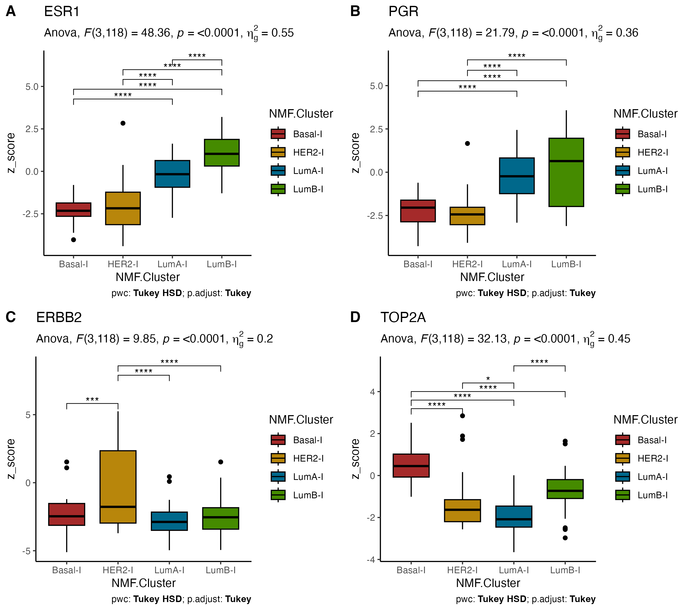

```{r setup, include=FALSE, eval=TRUE}

knitr::opts_chunk$set(echo = TRUE, warning = FALSE, message = FALSE)
source('0.libraries.R')
```


## Retrieve mutations' functional impact 


The mutations dataframe (somatic_mutation_dataframe.tsv) was prepared for subsequent annotation using MafAnnotator from OncoKB, as described here: https://github.com/oncokb/oncokb-annotator#oncokb-api. A
fter annotation, the processed mutation file was reimported and transformed into a 
gene-mutation matrix (Brca_mutations.tsv).
 


```{r mutations, eval=FALSE}

# Load and preprocess the somatic mutation file for OncoKB annotation
somatic_mutations <- read_tsv("somatic_mutation_dataframe.tsv") %>%
  t() %>%
  as.data.frame() %>%
  rownames_to_column(var = "Tumor_Sample_Barcode") %>%
  slice(-1) %>%  
  setNames(c("Tumor_Sample_Barcode", "Hugo_Symbol", "Variant_Classification", "HGVSp_Short")) %>%
  relocate(Hugo_Symbol, Variant_Classification, Tumor_Sample_Barcode, HGVSp_Short) %>%
  mutate(HGVSp = HGVSp_Short)  

write_delim(somatic_mutations, "somatic_mutation_3_maf.txt", delim = "\t", col_names = TRUE)


# Load the OncoKB-annotated mutation file and clinical data
somatic_mutations_annotated <- read_tsv("somatic_mutation_3_annotated_maf.txt")
clinical_dataframe <- read_tsv("clinical_dataframe.tsv")

# Process the clinical dataframe: transpose and extract relevant columns
full_clinical_data <- clinical_dataframe %>%
  column_to_rownames(var = "Name") %>%
  t() %>%
  as.data.frame() %>%
  select(5, 8) %>%  
  rownames_to_column(var = "Patient_ID") %>%
  relocate(Patient_ID) %>%
  select(-2)  

# Process somatic mutations and extract Patient ID
somatic_mutations_processed <- somatic_mutations_annotated %>%
  mutate(Patient_ID = substr(Tumor_Sample_Barcode, 1, 9) %>% str_remove("\\.")) %>%
  relocate(Patient_ID)

# Merge mutations with clinical data
mutations_clinical_merged <- left_join(somatic_mutations_processed, full_clinical_data, by = "Patient_ID")

# Filter for oncogenic mutations
oncogenic_mutations <- mutations_clinical_merged %>%
  filter(ONCOGENIC %in% c("Oncogenic", "Likely Oncogenic"))

# Create gene-mutation matrix
genes <- unique(oncogenic_mutations$Hugo_Symbol)
patients <- unique(oncogenic_mutations$Patient_ID)

# Initialize matrix with 0
genes_matrix <- matrix(0, nrow = length(patients), ncol = length(genes), 
                       dimnames = list(patients, genes))


# Map values directly onto the matrix without using a nested for-loop
oncogenic_mutations %>%
  mutate(value = ifelse(MUTATION_EFFECT %in% c("Gain-of-function", "Likely Gain-of-function"), 1, -1)) %>%
  rowwise() %>%
  mutate(genes_matrix[Patient_ID, Hugo_Symbol] <<- value)

# Convert to dataframe and save
matrice_geni <- as.data.frame(genes_matrix) %>%
  rownames_to_column(var = "Patient_ID")

write_tsv(matrice_geni, "Brca_mutations.tsv")
write_xlsx(matrice_geni, "Table_1.xlsx")


```


## PatientProfiler Step 1: Harmonization of input data 

In this first step, we processed the input breast cancer data (transcriptomics, proteomics, and phosphoproteomics) through parsing, filtering, imputation, quality control, and z-scoring.

```{r Step1, eval=FALSE}

transcriptomics_data <- read_tsv("Brca_transc.tsv") 
transcriptomics_data <- transcriptomics_data %>% dplyr::rename(gene_name = Name)

proteomics_data <- read_tsv("Brca_prot.tsv") 
proteomics_data <- proteomics_data %>% dplyr::rename(gene_name = Name) %>% select(-Database_ID)

phosphoproteomics_data <- read_tsv("Brca_phospho.tsv")  
phosphoproteomics_data <-phosphoproteomics_data %>% dplyr::rename(gene_name = Name) %>% select(-Database_ID)


omics_update(
  df_tr = transcriptomics_data,   
  df_pr = proteomics_data,   
  df_ph = phosphoproteomics_data,  
  threshold = 80,
  sw_len = 7,
  pep_col_name = "Peptide",
  imp_method = "norm", 
  m = 5,
  zscore = TRUE,   
  zmethod = "column",   
  metric = "median",
  output_dir = './'
)

```


## Expression level of known biomarkers

Protein expression level of known biomarkers in different subtypes, after data manipulation (Step1) (ESR1: estrogen receptor, PGR: progesterone receptor, ERBB2/HER2: human epidermal growth factor receptor 2, TOP2A: proliferative biomarker)


The result of this analysis is reported in **Figure 2F.**


```{r Expression level of known biomarkers, eval = FALSE}

clinical_dataframe <- read_tsv("clinical_dataframe.tsv") %>%
  column_to_rownames("Name") %>%
  t() %>%
  as.data.frame() %>%
  dplyr::select(Stage, NMF.Cluster) %>%
  mutate(patient_ID = rownames(.))

proteomics <- read_tsv("Proteomics_updated.tsv") %>%
  dplyr::select(-1)

data_long_proteo <- proteomics %>%
  pivot_longer(cols = -gene_name, names_to = "patient_ID", values_to = "z_score")

table_summary_proteo <- merge(clinical_dataframe, data_long_proteo, by = "patient_ID")

NMF.Cluster <- c("Basal-I", "HER2-I", "LumA-I", "LumB-I")
table_summary_proteo$NMF.Cluster <- factor(table_summary_proteo$NMF.Cluster, levels = NMF.Cluster)

my_colors <- c("Basal-I" = "brown", "HER2-I" = "darkgoldenrod", 
               "LumB-I" = "chartreuse4", "LumA-I" = "deepskyblue4")

known_biomarkers <- c("ESR1", "PGR", "ERBB2", "TOP2A")

plot_list <- list()

for (gene_i in known_biomarkers) {
  cat("Processing:", gene_i, "\n")
  
  table_summary_gene <- table_summary_proteo %>%
    filter(gene_name == gene_i)
  
  if (n_distinct(table_summary_gene$NMF.Cluster) > 1) {
    table_summary_gene$NMF.Cluster <- factor(table_summary_gene$NMF.Cluster, levels = NMF.Cluster)
    
    # ANOVA + post-hoc con rstatix
    res.aov <- table_summary_gene %>% anova_test(z_score ~ NMF.Cluster)
    tukey_result <- table_summary_gene %>% tukey_hsd(z_score ~ NMF.Cluster)
    tukey_result <- tukey_result %>% add_xy_position(x = "NMF.Cluster")
    
    plot_i <- ggboxplot(table_summary_gene, x = "NMF.Cluster", y = "z_score", fill = "NMF.Cluster") +
      stat_pvalue_manual(tukey_result, hide.ns = TRUE) +
      scale_fill_manual(values = my_colors) +
      theme_classic() +
      labs(
        title = gene_i,
        subtitle = get_test_label(res.aov, detailed = TRUE),
        caption = get_pwc_label(tukey_result)
      )
    
    plot_list[[gene_i]] <- plot_i
  }
}

if (length(plot_list) > 0) {
  combined_plots <- plot_grid(plotlist = plot_list, labels = "AUTO", 
                              nrow = ceiling(length(plot_list) / 2), ncol = 2)
  print(combined_plots)
}


```

