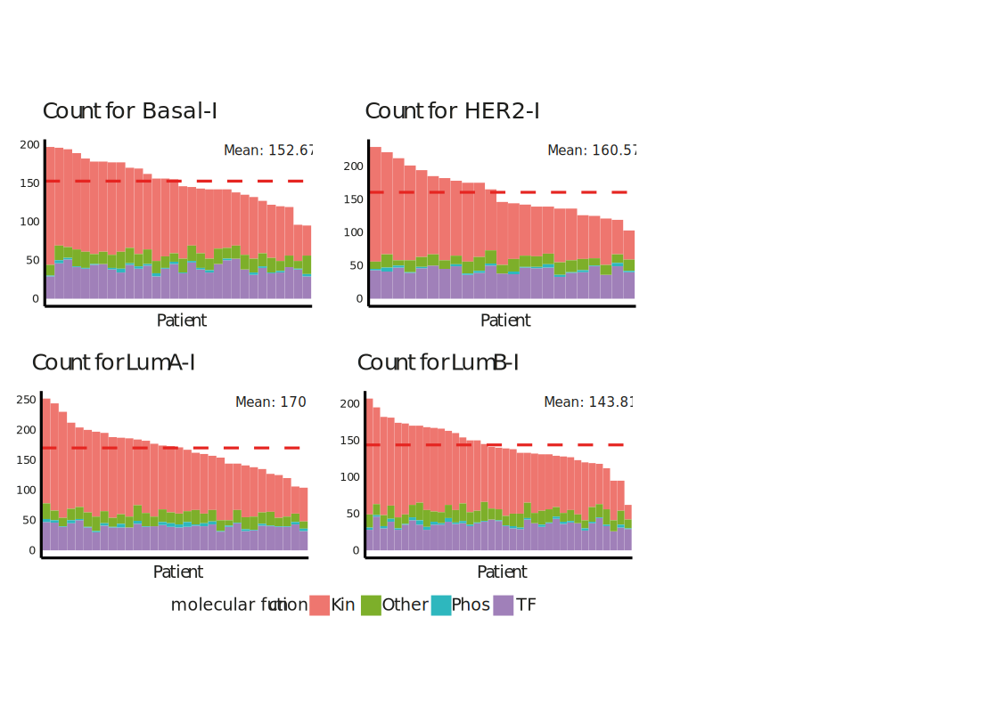

```{r setup, include=FALSE, eval = TRUE}

knitr::opts_chunk$set(echo = TRUE, warning = FALSE, message = FALSE)
source('0.libraries.R')
```


## Data's preparation

For each uploaded omic type, a folder with a user-defined name will be
created. Each folder will contain a file (data frame) for each patient,
representing the needed omic input needed in SignalingProfiler-compliant
format for the next steps.


```{r Prepare data to SP, eval = FALSE}

tr_updated <- read_tsv("../Step1/Transcriptomics_updated.tsv")
pr_updated <- read_tsv("../Step1/Proteomics_updated.tsv")
ph_updated <- read_csv("../Step1/Phosphoproteomics_updated.tsv")

omics_preparation(
              df_tr_updated = tr_updated,           
              df_pr_updated = pr_updated, 
              df_ph_updated = ph_updated,             
              transc_dir_name = "./Transc_patients",   
              prot_dir_name = "./Prot_patients",                  
              phospho_dir_name = "./Phospho_patients"
              )
```

## Step2: Protein activity inference

To perform the protein activity inference step for all the patients of a
cohort, this function loops on each omic file for each patient and infer
protein activity.

```{r Protein activity inference, eval = FALSE}
tf_params <- list(hypergeom_corr = FALSE, correct_proteomics = FALSE)
kin_params <- list(hypergeom_corr = FALSE, correct_proteomics = TRUE )

extract_cohort_activity(
                        prot_dir = "./Prot_patients/", 
                        trans_dir = "./Transc_patients/",
                        phospho_dir = "./Phospho_patients/", 
                        tf_params, 
                        kin_params,
                        output_dir = "Activities"
                        )

```


## FIGURES

Estimated protein activities in individual patients, stratified by subtypes.
The result of this analysis is reported and readapted in **Figure 2G.**


```{r Esimated protein activities in individual patients, eval = FALSE, fig.width=5, fig.height=4}

clinical_dataframe <- read_tsv("../Step1/clinical_dataframe.tsv")

# Transform the clinical dataframe
rownames(clinical_dataframe) <- clinical_dataframe$Name
clinical_dataframe.T <- as.data.frame(t(clinical_dataframe))[-1, , drop = FALSE]
clinical_dataframe.T <- clinical_dataframe.T[, c(5, 8), drop = FALSE]
clinical_dataframe.T$patient_ID <- rownames(clinical_dataframe.T)
pat_risk <- clinical_dataframe.T[,-1]

# Initialize final table
Tabella_totale_risk <- list()

# Iterate over patient names
for (i in seq_along(pat_risk$patient_ID)) {
  
  # Read patient data
  patient_file <- paste0("../Step2/Activities/Activity_Patient_", pat_risk$patient_ID[i], ".tsv")
  patient_file <- read_csv(patient_file)
  
  # Create vectors for risk factors
  risk_factors <- as.list(pat_risk[i, ])
  risk_matrix <- as.data.frame(lapply(risk_factors, rep, nrow(patient_file)))
  
  # Combine data
  patient_file <- cbind(risk_matrix, patient_file)
  
  # Append to final list
  Tabella_totale_risk[[i]] <- patient_file
}

# Combine all patient data into a single dataframe
Tabella_totale_risk <- bind_rows(Tabella_totale_risk) %>% unique()


## Load data
activity <- Tabella_totale_risk


# Aggregate data: count occurrences per patient_ID, NMF.Cluster, and mf
agg_df <- activity %>%
  dplyr::group_by(patient_ID, NMF.Cluster, mf) %>%
  dplyr::summarise(count_single = n(), .groups = 'drop')

# Compute total counts and mean counts per cluster
mean_counts <- activity %>%
  dplyr::group_by(patient_ID, NMF.Cluster) %>%
  dplyr::summarise(count_tot = n(), .groups = 'drop') %>%
  dplyr::group_by(NMF.Cluster) %>%
  dplyr::mutate(mean_count_tot = mean(count_tot)) %>%
  dplyr::ungroup()

# Merge aggregated data
agg_df <- left_join(agg_df, mean_counts, by = c("patient_ID", "NMF.Cluster"))

# Order data for plotting
agg_df <- agg_df %>%
  arrange(NMF.Cluster, desc(count_tot)) %>%
  mutate(patient_ID = factor(patient_ID, levels = unique(patient_ID[order(count_tot, decreasing = TRUE)])))

# Get unique clusters
clusters <- unique(agg_df$NMF.Cluster)

# Function to create plots for each cluster
create_plot <- function(cluster) {
  df_cluster <- filter(agg_df, NMF.Cluster == cluster) %>% arrange(desc(count_single))
  df_cluster$patient_ID <- factor(df_cluster$patient_ID, levels = unique(df_cluster$patient_ID[order(df_cluster$count_tot, decreasing = TRUE)]))
  
  ggplot(df_cluster, aes(x = patient_ID, y = count_single, fill = mf)) +
    geom_bar(stat = "identity", position = "stack", width = 0.99) +
    geom_hline(aes(yintercept = mean_count_tot), color = "red", linetype = "dashed") +
    labs(title = paste("Count for", cluster),
         x = "Patient",
         y = "Count",
         fill = "Molecular Function") +
    theme_classic() +
    theme(axis.text.x = element_text(angle = 45, hjust = 1, vjust = 1, size = 0),
          legend.position = "top",
          legend.title = element_text(size = 10),
          legend.text = element_text(size = 8)) +
    annotate("text", x = Inf, y = Inf, label = paste("Mean:", round(unique(df_cluster$mean_count_tot), 2)),
             hjust = 1, vjust = 1, color = "red", size = 3)
}

# Generate plots for each cluster
plot_list <- lapply(clusters, create_plot)

# Compute proportions for each cluster
prop <- sapply(plot_list, function(p) length(levels(p$data$patient_ID)))

# # Combine plots into a grid
combined_plot <- plot_grid(plotlist = plot_list, ncol = 4, align = 'h', rel_heights = 1 * prop, scale = TRUE)

```




## Add mutated proteins as constraints

Process patient-activity data by incorporating mutated proteins as constraints


```{r Constraints, eval = FALSE}

# Load clinical data and extract patient ids
clinical_dataframe <- read_tsv("../Step1/clinical_dataframe.tsv")
rownames(clinical_dataframe) <- clinical_dataframe$Name
clinical_dataframe.T <- as.data.frame(t(clinical_dataframe))[-1, , drop = FALSE]
clinical_dataframe.T <- clinical_dataframe.T[, c(5, 8), drop = FALSE]
clinical_dataframe.T$patient_ID <- rownames(clinical_dataframe.T)
pat_names <- clinical_dataframe.T$patient_ID

# Load gene matrix
gene_matrix <- read_tsv("../Step1/Brca_mutations.tsv")

total_patients <- length(pat_names)

# Iterate through patients
for (i in seq_len(total_patients)) {
  patient_id <- pat_names[i]
  
  # Load patient data
  patient_file <- paste0("Activities/Activity_Patient_", patient_id, ".tsv")
  Patient <- read_tsv(patient_file)
  
  # Check if patient exists in the gene matrix
  if (patient_id %in% gene_matrix$Patient_ID) {
    gene_names <- setdiff(colnames(gene_matrix), "Patient_ID")
    
    # Iterate through genes
    for (gene in gene_names) {
      if (gene %in% Patient$gene_name) {
        message("Updating common gene for patient: ", patient_id)
        
        Patient$final_score[Patient$gene_name == gene] <- gene_matrix[gene_matrix$Patient_ID == patient_id, gene][[1]]
        Patient$method[Patient$gene_name == gene] <- "constraints"
        Patient$mf[Patient$gene_name == gene] <- "rec"
        
      } else {
        message("Adding missing gene for patient: ", patient_id)
        
        final_score_value <- as.numeric(gene_matrix[gene_matrix$Patient_ID == patient_id, gene][[1]])
        new_row <- data.frame(
          gene_name = gene,
          final_score = final_score_value,
          UNIPROT = NA,
          mf = "rec",
          method = "constraints",
          stringsAsFactors = FALSE
        )
        
        Patient <- rbind(Patient, new_row)
      }
    }
    

    df_for_ids <- SignalingProfiler::PKN_proteins_human
    
  
    # Step 1: Find the rows in Patient where UNIPROT is NA
    missing_uniprot <- is.na(Patient$UNIPROT)
    
    # Step 2: For the rows with NA in UNIPROT, search for the match between gene_name and ENTITY in df_for_ids
    for (i in which(missing_uniprot)) {
      # Find the gene_name in Patient corresponding to ENTITY in df_for_ids
      gene_name_patient <- Patient$gene_name[i]
      
      # Find the matching ID in df_for_ids based on the ENTITY
      matching_id <- df_for_ids$ID[df_for_ids$ENTITY == gene_name_patient]
      
      # If a match is found, update the UNIPROT field
      if (length(matching_id) > 0) {
        Patient$UNIPROT[i] <- matching_id[1]  # In case of multiple matches, take the first one
      }
    }
  
    output_file <- paste0("Activities/Activity_constraints_Patient_", patient_id, ".tsv")
    write_tsv(Patient, output_file)
  }
}


```


