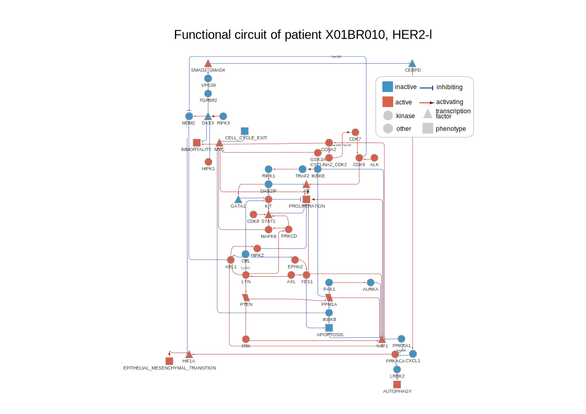
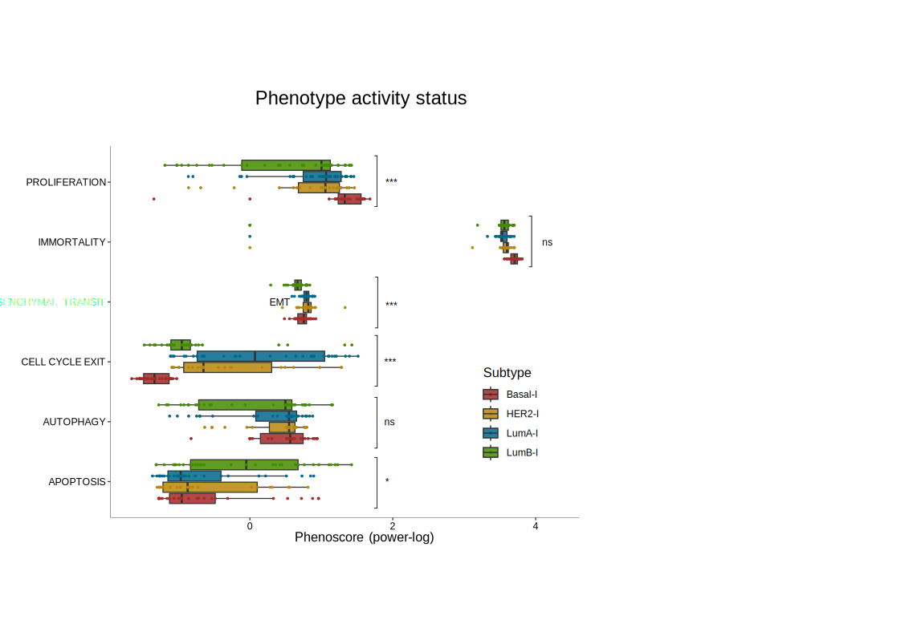

```{r setup, include=FALSE, eval = TRUE}

knitr::opts_chunk$set(echo = TRUE, warning = FALSE, message = FALSE)
source('0.libraries.R')
```

## Step3: Generation of mechanistic models

In this step, PatientProfiler creates for each patient a causal network connecting mutated genes to a user-defined set of cellular functional traits (e.g., APOPTOSIS, PROLIFERATION).

Importantly, this step requires a mutations file where rows are patients and columns are genes, and each cell is the impact on protein function of the mutation. File is generated in Step1.

```{r networks, eval = FALSE}

output_dir <- 'Networks_output'
network_params <- initialize_net_default_params(output_dir)


create_cohort_networks(trans_dir = './Transc_patients/',
                      prot_dir = './Prot_patients/',
                      phospho_dir = './Phospho_patients/',
                      act_dir = './Activities/',
                      mut_file = '../Step1/Brca_mutations.tsv',
                      output_dir = './Networks_output/',
                      desired_phenotypes = c("ANGIOGENESIS",
                                                "APOPTOSIS",
                                                "AUTOPHAGY",
                                                "BROWN_ADIPOGENESIS",
                                                "CELL_CYCLE_EXIT",
                                                "CELL_KILLING",
                                                "ECM_DISASSEMBLY",
                                                "ECM_SYNTHESIS",
                                                "EPITHELIAL_MESENCHYMAL_TRANSITION",
                                                "IMMORTALITY" ,
                                                "INFLAMMATION" ,
                                                "PLURIPOTENCY",
                                                "PROLIFERATION" ,
                                                "TELOMERE_MAINTENANCE"),
                      pheno_distances_table = TRUE,
                      save_all_files = FALSE,
                      PKN_options = list(preprocess = TRUE, organism = 'human', direct = FALSE, with_atlas = FALSE, custom = FALSE, custom_path = FALSE),
                      naive_options =list(layers = 2, max_length = c(1, 4), connect_all = TRUE, naive_path = paste0(output_dir, '/Naive_')), 
                      carnival_options = list(solver = 'cplex', carnival_type = 'inverse', opt_path = paste0(output_dir, '/Opt_'), carnival_params = list()),
                      phenoscore_options = list(pheno_path = paste0(output_dir, '/Pheno_'),
                                                pheno_distance_table = NULL,
                                                phenoscore_params = list(
                                                  path_length = 3, stat = 'median', zscore_threshold = -1.96,
                                                  nrandom = 1000, pvalue_threshold = 0.05,
                                                  remove_cascade = TRUE, node_idx = FALSE, use_carnival_activity = FALSE,
                                                  create_pheno_network = TRUE), 
                      format_options = list(optimize_on_phenotypes = TRUE,
                                            circuits_params = list(k =10, start_to_top = TRUE),
                                            vis_cytoscape = FALSE)))
```

You can decide whether to visualize the functional circuits in Cytoscape. To do this, you need to open the Cytoscape app, and the result will be displayed. For example, for Patient_ID = "X01BR010", the outcome is shown in **Figure 3A.**

```{r visualize network, eval = FALSE}

patient_id <- 'X01BR010'

# Read mutation file (starting nodes of the model)
mutations_df <- read_tsv('../Step1/Brca_mutations.tsv', show_col_types = F)
sources <- mutations_df[mutations_df$Patient_ID == patient_id, ]

# Read activity file (intermediate nodes of the model)
activities <- read_tsv(paste0('./Activities/Activity_constraints_Patient_', patient_id, '.tsv'), show_col_types = F)

# Set the functional traits vector (final nodes of the model)
desired_phenotypes <- c("ANGIOGENESIS",
                        "APOPTOSIS",
                        "AUTOPHAGY",
                        "BROWN_ADIPOGENESIS",
                        "CELL_CYCLE_EXIT",
                        "CELL_KILLING",
                        "ECM_DISASSEMBLY",
                        "ECM_SYNTHESIS",
                        "EPITHELIAL_MESENCHYMAL_TRANSITION",
                        "IMMORTALITY",
                        "INFLAMMATION",
                        "PLURIPOTENCY",
                        "PROLIFERATION",
                        "TELOMERE_MAINTENANCE")

# Read omics file
proteomics <- read_tsv(paste0('./Prot_patients/Prot_Patient_', patient_id, '.tsv'), , show_col_types = F)
transcriptomics <- read_tsv(paste0('./Transc_patients/Transc_Patient_', patient_id, '.tsv'), show_col_types = F)
phosphoproteomics <- read_tsv(paste0('./Phospho_patients/Phospho_Patient_', patient_id, '.tsv'),show_col_types = F)

# ProxPath proteins-to-phenotypes pre-processing
pheno_distances_table <- proxpath_preprocessing(proteomics = proteomics, 
                                                phosphoproteomics = phosphoproteomics)

create_network(patient_id = patient_id,
              sources = sources,
              activities = activities,
              transcriptomics = transcriptomics,
              proteomics = proteomics,
              phosphoproteomics = phosphoproteomics,
              desired_phenotypes = desired_phenotypes,
              pheno_distances_table = pheno_distances_table,
              output_dir = 'Networks_output',
              save_all_files = FALSE,
              PKN_options = list(preprocess = TRUE, organism = 'human', direct = FALSE, with_atlas = FALSE, custom = FALSE, custom_path = FALSE),
              naive_options = list(layers = 2, max_length = c(1, 4), connect_all = TRUE, naive_path = paste0(output_dir, '/Naive_')),
              carnival_options = list(solver = 'cplex', carnival_type = 'inverse', opt_path = paste0(output_dir, '/Opt_'), carnival_params = list()),
              phenoscore_options = list(pheno_path = paste0(output_dir, '/Pheno_'),
                                                pheno_distance_table = NULL,
                                                phenoscore_params = list(
                                                  path_length = 3, stat = 'median', zscore_threshold = -1.96,
                                                  nrandom = 1000, pvalue_threshold = 0.05,
                                                  remove_cascade = TRUE, node_idx = FALSE, use_carnival_activity = FALSE,
                                                  create_pheno_network = TRUE),
              list(optimize_on_phenotypes = TRUE,
                                            circuits_params = list(k =10, start_to_top = TRUE),
                                            vis_cytoscape = TRUE))
```



## FIGURES

Summary of the network size, as shown by the distribution of the number of nodes (top) and edges (bottom) in individual patients, stratified by subtypes. The dashed-red bar indicates the average number of estimated nodes and edges in each subgroup The result of this analysis is reported in **Figure 3B.**

```{r 3b, include=FALSE, eval = FALSE}
# Load clinical data and extract patient ids
clinical_dataframe <- read_tsv("../Step1/clinical_dataframe.tsv")
rownames(clinical_dataframe) <- clinical_dataframe$Name
clinical_dataframe.T <- as.data.frame(t(clinical_dataframe))[-1, , drop = FALSE]
clinical_dataframe.T <- clinical_dataframe.T[, c(5, 8), drop = FALSE]
clinical_dataframe.T$patient_ID <- rownames(clinical_dataframe.T)
pat_names <- clinical_dataframe.T$patient_ID

# Prepare for storing results
nodes_list <- list()
edges_list <- list()

# Loop through patient names
for (r in seq_along(pat_names)) {
  
  # Read RDS file for each patient
  opt1 <- read_rds(paste0('Networks_output/Pheno_', as.character(pat_names[r]), ".RDS"))
  nodes <- opt1$sp_object_phenotypes$nodes_df
  edges <- opt1$sp_object_phenotypes$edges_df
  
  # Add patient information to nodes and edges
  patient_data <- clinical_dataframe.T[r, ]
  nodes$patient_ID <- patient_data$patient_ID
  nodes$NMF.Cluster <- patient_data$NMF.Cluster
  edges$patient_ID <- patient_data$patient_ID
  edges$NMF.Cluster <- patient_data$NMF.Cluster
  
  # Append nodes and edges to respective lists
  nodes_list[[r]] <- nodes
  edges_list[[r]] <- edges
}

# Combine all nodes and edges into dataframes
nodes_total <- bind_rows(nodes_list)
edges_total <- bind_rows(edges_list)

#### NODES COUNT

# Mutate carnival_activity directly
nodes_total <- nodes_total %>%
  mutate(carnival_activity = ifelse(carnival_activity > 0, 100, -100))

# Aggregation: Count by patient_ID, NMF.Cluster, and carnival_activity
agg_df <- nodes_total %>%
  dplyr::group_by(patient_ID, NMF.Cluster, carnival_activity) %>%
  dplyr::summarize(count_single = n(), .groups = 'drop')

# Calculate total count and mean count for each NMF.Cluster
mean_counts <- nodes_total %>%
  dplyr::group_by(patient_ID, NMF.Cluster) %>%
  dplyr::summarize(count_tot = n(), .groups = 'drop') %>%
  dplyr::group_by(NMF.Cluster) %>%
  dplyr::mutate(mean_count_tot = mean(count_tot)) %>%
  dplyr::ungroup()

# Merge aggregated data with mean counts
agg_df <- left_join(agg_df, mean_counts, by = c("patient_ID", "NMF.Cluster"))

# Sort by NMF.Cluster and count_tot, and reorder patient_ID
agg_df <- agg_df %>%
  dplyr::arrange(NMF.Cluster, desc(count_tot)) %>%
  dplyr::mutate(patient_ID = factor(patient_ID, levels = unique(patient_ID[order(count_tot, decreasing = TRUE)])))

# Get unique clusters
clusters <- unique(agg_df$NMF.Cluster)

# Function to create plots for a single cluster
create_plot <- function(cluster) {
  # Filter data for current cluster
  df_cluster <- filter(agg_df, NMF.Cluster == cluster) %>%
    arrange(desc(carnival_activity))  # Ensure carnival_activity is ordered
  
  # Define color mapping for carnival_activity
  color_mapping <- c("-100" = "#4492C2", "100" = "#D7604D")
  
  # Create the bar plot with mean line
  p <- ggplot(df_cluster, aes(x = patient_ID, y = count_single, fill = as.factor(carnival_activity))) +
    geom_bar(stat = "identity", position = "stack", width = 0.99) +
    geom_hline(aes(yintercept = mean_count_tot), color = "red", linetype = "dashed") +
    scale_fill_manual(values = color_mapping) +
    labs(title = paste("Count for", cluster),
         x = "Patient",
         y = "Count",
         fill = "Carnival Activity") +
    theme_classic() +
    theme(axis.text.x = element_text(angle = 45, hjust = 1, vjust = 1, size = 8),
          legend.position = "top",
          legend.title = element_text(size = 10),
          legend.text = element_text(size = 8)) +
    annotate("text", x = Inf, y = Inf, label = paste("Mean:", round(unique(df_cluster$mean_count_tot), 2)),
             hjust = 1.1, vjust = 1.1, color = "red", size = 3)
  
  return(p)
}

# Create plots for each cluster
plot_list <- lapply(clusters, create_plot)

# Calculate relative proportions for height of each plot
prop <- sapply(plot_list, function(p) {
  if (inherits(p, "gg")) {
    return(length(unique(p$data$patient_ID)))
  } else {
    return(1)
  }
})


# Combine plots in a grid with relative heights
combined_plot <- plot_grid(plotlist = plot_list, ncol = 4, align = 'h', rel_heights = prop)


#### EDGES COUNT

# Aggregating the data: Calculate counts for each combination of patient_ID, NMF.Cluster, and sign
agg_df <- edges_total %>%
  dplyr::group_by(patient_ID, NMF.Cluster, sign) %>%
  dplyr::summarize(count_single = n(), .groups = 'drop')

# Calculate total counts and mean for each NMF.Cluster and merge them into agg_df
mean_counts <- edges_total %>%
  dplyr::group_by(patient_ID, NMF.Cluster) %>%
  dplyr::summarize(count_tot = n(), .groups = 'drop') %>%
  dplyr::group_by(NMF.Cluster) %>%
  dplyr::mutate(mean_count_tot = mean(count_tot)) %>%
  dplyr::ungroup()

# Merge the aggregated data with the mean counts
agg_df <- left_join(agg_df, mean_counts, by = c("patient_ID", "NMF.Cluster"))

# Sort the data and reorder patient_ID factor levels
agg_df <- agg_df %>%
  dplyr::arrange(NMF.Cluster, desc(count_tot)) %>%
  dplyr::mutate(patient_ID = factor(patient_ID, levels = unique(patient_ID[order(count_tot, decreasing = TRUE)])))


# Get unique cluster names
clusters <- unique(agg_df$NMF.Cluster)

# Function to create plots for each cluster
create_plot <- function(cluster) {
  # Filter data for the current cluster and ensure sorted by 'sign'
  df_cluster <- filter(agg_df, NMF.Cluster == cluster) %>%
    arrange(desc(sign))  # Ensure 'sign' order is respected
  
  # Define color mapping for 'sign' values
  color_mapping <- c("-1" = "#4492C2", "1" = "#D7604D")
  
  # Create the barplot with the mean line
  p <- ggplot(df_cluster, aes(x = patient_ID, y = count_single, fill = as.factor(sign))) +
    geom_bar(stat = "identity", position = "stack", width = 0.99) +
    geom_hline(aes(yintercept = mean_count_tot), color = "red", linetype = "dashed") +
    scale_fill_manual(values = color_mapping) +
    labs(title = paste("Count for", cluster),
         x = "Patient",
         y = "Count",
         fill = "Sign") +
    theme_classic() +
    theme(axis.text.x = element_text(angle = 45, hjust = 1, vjust = 1, size = 8),
          legend.position = "top",
          legend.title = element_text(size = 10),
          legend.text = element_text(size = 8)) +
    annotate("text", x = Inf, y = Inf, label = paste("Mean:", round(unique(df_cluster$mean_count_tot), 2)),
             hjust = 1.1, vjust = 1.1, color = "red", size = 3)
  
  return(p)
}

# Create plots for all clusters
plot_list <- lapply(clusters, create_plot)

# Calculate relative heights for the plots
prop <- sapply(plot_list, function(p) {
  if (inherits(p, "gg")) {
    return(length(unique(p$data$patient_ID)))
  } else {
    return(1)
  }
})

# Combine plots in a grid with relative heights
combined_plot <- plot_grid(plotlist = plot_list, ncol = 4, align = 'h', rel_heights = prop)
```


Activation level (power-log of the PhenoScore) of key hallmark phenotypes in different subtypes as measured in the STEP3 of the PatientProfiler pipeline. Subtype color code: Basal-l in red, LumA-l in blue, LumB-l in green, and HER2-l in yellow. The result of this analysis is reported in **Figure 3C.**

```{r phenoplot 3C, eval = FALSE}

# Load clinical data and extract patient ids
clinical_dataframe <- read_tsv("../Step1/clinical_dataframe.tsv")
rownames(clinical_dataframe) <- clinical_dataframe$Name
clinical_dataframe.T <- as.data.frame(t(clinical_dataframe))[-1, , drop = FALSE]
clinical_dataframe.T <- clinical_dataframe.T[, c(5, 8), drop = FALSE]
clinical_dataframe.T$patient_ID <- rownames(clinical_dataframe.T)
pat_names <- clinical_dataframe.T$patient_ID

# Prepare for storing results
nodes_list <- list()
edges_list <- list()

# Loop through patient names
for (r in seq_along(pat_names)) {
  
  # Read RDS file for each patient
  opt1 <- read_rds(paste0('Networks_output/Pheno_', as.character(pat_names[r]), ".RDS"))
  nodes <- opt1$sp_object_phenotypes$nodes_df
  edges <- opt1$sp_object_phenotypes$edges_df
  
  # Add patient information to nodes and edges
  patient_data <- clinical_dataframe.T[r, ]
  nodes$patient_ID <- patient_data$patient_ID
  nodes$NMF.Cluster <- patient_data$NMF.Cluster
  edges$patient_ID <- patient_data$patient_ID
  edges$NMF.Cluster <- patient_data$NMF.Cluster
  
  # Append nodes and edges to respective lists
  nodes_list[[r]] <- nodes
  edges_list[[r]] <- edges
}

# Combine all nodes and edges into dataframes
nodes_total <- bind_rows(nodes_list)


# Filter nodes with method "phenoscore" and select relevant columns
NMF <- nodes_total %>%
  filter(method == "phenoscore") %>%
  select(gene_name, final_score, NMF.Cluster) %>%
  filter(!gene_name %in% c("BROWN ADIPOGENESIS", "TELOMERE MAINTENANCE"))

# Define a symmetric logarithmic transformation function
symlog <- function(x, base = 2) {
  sign(x) * log(abs(x) + 1, base)
}

# Apply conditional log transformation
NMF <- NMF %>%
  mutate(final_score_transformed = ifelse(
    gene_name %in% c("IMMORTALITY", "EPITHELIAL-MESENCHYMAL TRANSITION"),
    symlog(final_score, base = 2),  # Use log base 2 for specific genes
    log10(abs(final_score) + 1) * sign(final_score)  # Log10 with sign for others
  ))

# Define color mapping for NMF clusters
cluster_colors <- c("Basal-I" = "brown", "HER2-I" = "darkgoldenrod", 
                    "LumB-I" = "chartreuse4", "LumA-I" = "deepskyblue4")

# Create the plot
phenoplot <- ggplot(NMF, aes(x = gene_name, y = final_score_transformed, fill = NMF.Cluster)) +
  geom_boxplot(alpha = 0.85, outlier.shape = NA) +  # Boxplot without visible outliers
  geom_jitter(aes(colour = NMF.Cluster), position = position_dodge(width = 0.75), size = 0.75) +
  scale_color_manual(values = cluster_colors) +
  scale_fill_manual(values = cluster_colors) +
  coord_flip() +
  theme_classic() +
  theme(
    axis.line = element_line(colour = "gray51", size = 0.3),
    axis.text.x = element_text(face = "bold", color = "black", size = 10),
    axis.text.y = element_text(face = "bold", color = "black", size = 10)
  ) +
  labs(
    title = "Phenoscore NMF (Power-Log Scale)",
    x = "Phenotype",
    y = "Phenotype modulation (power-log scale)"
  )


```


