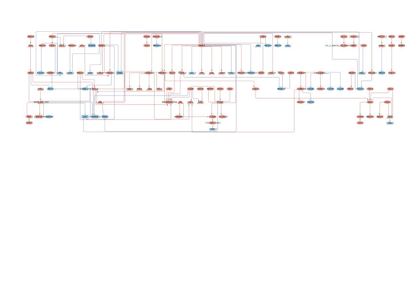

```{r setup, include=FALSE, eval = FALSE}

knitr::opts_chunk$set(echo = TRUE, warning = FALSE, message = FALSE)
source('0.libraries.R')
```


## Step4: Network_based stratification

In this step, PatientProfiler extracts communities from the
patient-specific mechanistic models generated in Step 3.


```{r communities, eval = FALSE}


dir.create("./input_communities", showWarnings = FALSE, recursive = TRUE)

clinical_dataframe <- read_tsv("../Step1/clinical_dataframe.tsv")
rownames(clinical_dataframe) <- clinical_dataframe$Name
clinical_dataframe.T <- as.data.frame(t(clinical_dataframe))[-1, , drop = FALSE]
clinical_dataframe.T <- clinical_dataframe.T[, c(5, 8), drop = FALSE]
clinical_dataframe.T$patient_ID <- rownames(clinical_dataframe.T)
clinical_dataframe.T <- clinical_dataframe.T %>% relocate(patient_ID) %>% dplyr::select (- Stage)
write_tsv(clinical_dataframe.T, "./input_communities/patients_stratification.tsv")


generate_communities(dir_path = "./input_communities", 
                     network_dir = "../Step3/Networks_output",
                     output_dir = "./Communities/output_communities")


```


## FIGURES

Pie charts depicting the subtype composition of each community. 
The result of this analysis is reported in **Figure 4B.**


```{r communities figures, eval = FALSE}

# Load patient stratification data
communities_dir <- "./output_communities/"
community_folders <- list.dirs(path = communities_dir, recursive = FALSE)
patients_list <- list()

for (folder in community_folders) {
  patient_file <- file.path(folder, "patients.txt")
  
  if (file.exists(patient_file)) {
    patient_data <- read_tsv(patient_file, col_names = c("patient_ID"))
    patient_data$community <- basename(folder)  
    patients_list[[length(patients_list) + 1]] <- patient_data
  }
}

patients_cluster <- bind_rows(patients_list)

# Load clinical data 
clinical_dataframe <- read_tsv("../Step1/clinical_dataframe.tsv")
rownames(clinical_dataframe) <- clinical_dataframe$Name
clinical_dataframe.T <- clinical_dataframe %>%
  t() %>%
  as.data.frame() %>%
  .[-1, , drop = FALSE] %>%
  dplyr::select(5, 8)
clinical_dataframe.T$patient_ID <- rownames(clinical_dataframe.T)


# Merge 
patients_cluster <- left_join(patients_cluster, clinical_dataframe.T, by = "patient_ID")


write_tsv(patients_cluster[, -3], "patients_cluster.tsv")


# Define colors for Subtypes
mycols <- c("Basal-I" = "brown", "HER2-I" = "darkgoldenrod", "LumA-I" = "deepskyblue4", "LumB-I" = "chartreuse4")


count_data <- patients_cluster %>%
  group_by(community, NMF.Cluster) %>%
  summarise(n = n(), .groups = "drop")


p <- ggplot(count_data, aes(x = community, y = n, fill = NMF.Cluster)) +
  geom_bar(stat = "identity") +
  geom_text(aes(label = n), position = position_stack(vjust = 0.5), color = "white", size = 3.5) +
  scale_fill_manual(name = "Subtype", values = mycols) +
  ylab("Number of patients") +
  xlab("Community") +
  ggtitle("Communities subdivision") +
  theme_minimal() +
  theme(
    axis.text.x = element_text(angle = 45, hjust = 1),
    panel.grid.major = element_blank(),
    panel.grid.minor = element_blank(),
    panel.border = element_blank(),
    axis.line = element_line(color = "black", size = 0.6)  
  )


```


Visualize Community 4 in Cytoscape. 
The result is reported in **Figure S11.** and **Figure 5A.**


```{r visualize community, eval = FALSE}

visualize_community(community_4)

```



