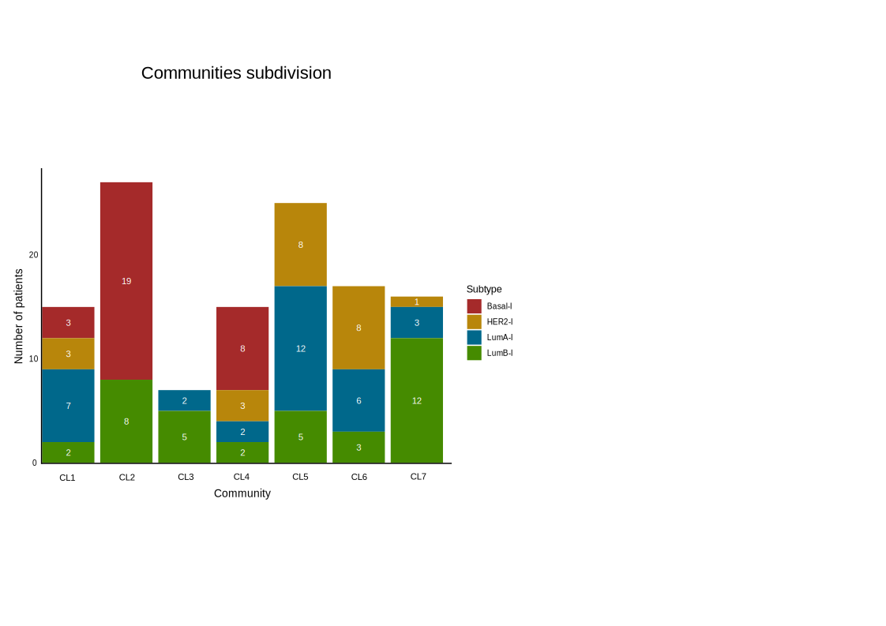

```{r setup, include=FALSE, eval = FALSE}

knitr::opts_chunk$set(echo = TRUE, warning = FALSE, message = FALSE)
source('0.libraries.R')
```


## Step4: Network_based stratification

In this step, PatientProfiler extracts communities from the
patient-specific mechanistic models generated in Step 3.


```{r communities, eval = FALSE}


dir.create("./input_communities", showWarnings = FALSE, recursive = TRUE)

clinical_dataframe <- read_tsv("../Step1/clinical_dataframe.tsv")
rownames(clinical_dataframe) <- clinical_dataframe$Name
clinical_dataframe.T <- as.data.frame(t(clinical_dataframe))[-1, , drop = FALSE]
clinical_dataframe.T <- clinical_dataframe.T[, c(5, 8), drop = FALSE]
clinical_dataframe.T$patient_ID <- rownames(clinical_dataframe.T)
clinical_dataframe.T <- clinical_dataframe.T %>% relocate(patient_ID) %>% dplyr::select (- Stage)
write_tsv(clinical_dataframe.T, "./input_communities/patients_stratification.tsv")


generate_communities(dir_path = "./input_communities", 
                     network_dir = "../Step3/Networks_output",
                     output_dir = "./output_communities",
                     local = FALSE)


```


## FIGURES

Pie charts depicting the subtype composition of each community. 
The result of this analysis is reported in **Figure 4B.**


```{r communities figures, eval = FALSE}

# Load patient stratification data
communities_dir <- "./output_communities/"
community_folders <- list.dirs(path = communities_dir, recursive = FALSE)
patients_list <- list()

for (folder in community_folders) {
  patient_file <- file.path(folder, "patients.txt")
  
  if (file.exists(patient_file)) {
    patient_data <- read_tsv(patient_file, col_names = c("patient_ID"))
    patient_data$community <- basename(folder)  
    patients_list[[length(patients_list) + 1]] <- patient_data
  }
}

patients_cluster <- bind_rows(patients_list)

# Load clinical data 
clinical_dataframe <- read_tsv("../Step1/clinical_dataframe.tsv")
rownames(clinical_dataframe) <- clinical_dataframe$Name
clinical_dataframe.T <- clinical_dataframe %>%
  t() %>%
  as.data.frame() %>%
  .[-1, , drop = FALSE] %>%
  dplyr::select(5, 8)
clinical_dataframe.T$patient_ID <- rownames(clinical_dataframe.T)


# Merge 
patients_cluster <- left_join(patients_cluster, clinical_dataframe.T, by = "patient_ID")


write_tsv(patients_cluster[, -3], "patients_cluster.tsv")


# Define colors for Subtypes
mycols <- c("Basal-I" = "brown", "HER2-I" = "darkgoldenrod", "LumA-I" = "deepskyblue4", "LumB-I" = "chartreuse4")

# Loop through unique clusters and generate pie charts
for (cluster_id in unique(patients_cluster$community)) {
  
  # Count occurrences of each NMF community in the current patient community
  count_data <- patients_cluster %>%
    dplyr::filter(community == cluster_id) %>%
    dplyr::group_by(NMF.Cluster) %>%
    dplyr::summarise(n = n(), .groups = "drop") %>%
    dplyr::mutate(prop = (n / sum(n)) * 100, lab.ypos = cumsum(prop) - 0.5 * prop) %>%
    dplyr::arrange(desc(NMF.Cluster))
  
  # Generate pie chart
  pie_chart_NMF <- ggplot(count_data, aes(x = "", y = prop, fill = NMF.Cluster)) +
    geom_bar(width = 1, stat = "identity", color = "white") +
    coord_polar("y", start = 0) +
    geom_text(aes(y = lab.ypos, label = n), color = "white", size = 4) + # Improved label visibility
    scale_fill_manual("Subtype", values = mycols) +
    theme_void() +
    ggtitle(cluster_id)
  
  print(pie_chart_NMF)
}


```




