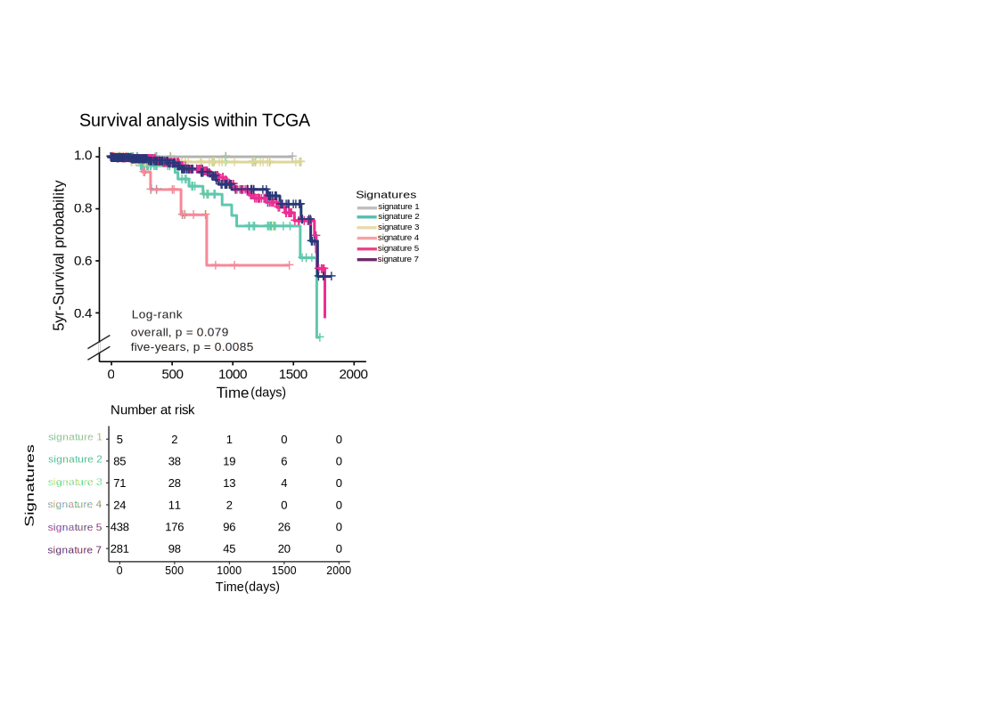

```{r setup, include=FALSE, eval=TRUE}

knitr::opts_chunk$set(echo = TRUE, warning = FALSE, message = FALSE)
source('0.libraries.R')
```


## Download and save TCGA clinical and transcriptomic data

```{r download TCGA data, include = FALSE, eval = FALSE}
# ===========================
# 1. DOWNLOAD CLINICAL DATA
# ===========================

# Retrieve project summary
gdcprojects <- getGDCprojects()
getProjectSummary("TCGA-BRCA")

# Query and download clinical data
query_TCGA <- GDCquery(
  project = "TCGA-BRCA",
  data.category = "Clinical",
  data.type = "Clinical Supplement"
)
GDCdownload(query_TCGA)

# Load clinical data
file_txt <- "nationwidechildrens.org_clinical_patient_brca.txt"
clinical <- read.delim(file_txt, sep = "\t", stringsAsFactors = FALSE, skip = 2) # Skip first two rows

# Rename patient ID column
colnames(clinical)[colnames(clinical) == "bcr_patient_barcode"] <- "patient_ID"

# Save the cleaned clinical data
write_tsv(clinical, "clinical_TCGA.tsv")

# ===============================
# 2. DOWNLOAD TRANSCRIPTOMICS DATA
# ===============================

# Query and download transcriptomic data
query_TCGA <- GDCquery(
  project = "TCGA-BRCA",
  data.category = "Transcriptome Profiling",
  experimental.strategy = "RNA-Seq",
  sample.type = "Primary Tumor",
  access = "open"
)
new_query <- getResults(query_TCGA)
GDCdownload(query_TCGA)

# ===============================
# 3. PROCESS TRANSCRIPTOMICS DATA
# ===============================

base_dir <- "./"

# Loop through all transcriptomics files
for (i in seq_len(nrow(new_query))) {
  
  id_value <- new_query[i, "id"]
  file_name <- new_query[i, "file_name"]
  file_path <- file.path(base_dir, id_value, file_name)
  
  if (file.exists(file_path)) {
    file_content <- read.table(file_path, sep = "\t", header = TRUE)
    
    # Ensure the reference variable exists
    if (exists("new_query")) {
      cases_value <- new_query[i, "cases"]
      
      # Rename the "unstranded" column with patient ID
      colnames(file_content)[colnames(file_content) == "unstranded"] <- as.character(cases_value)
      
      # Select only relevant columns
      file_content <- file_content[, c("gene_name", as.character(cases_value))]
      
      # Save the processed file
      write_tsv(file_content, file.path(base_dir, paste0(cases_value, ".tsv")))
    }
  } else {
    message("File not found: ", file_path)
  }
}

# ===================================
# 4. STANDARDIZE PATIENT ID FORMAT
# ===================================

# Iterate over transcriptomics files to clean patient IDs
for (new_file_name in list.files(base_dir, pattern = "\\.tsv$")) {
  new_file_path <- file.path(base_dir, new_file_name)
  file_content <- read.table(new_file_path, sep = "\t", header = TRUE)
  
  # Modify the second column name to match clinical format (TCGA-XX-XXXX)
  second_col_name <- colnames(file_content)[2]
  modified_col_name <- sub("^(([^\\.]*\\.){2}[^\\.]*).*", "\\1", second_col_name)
  modified_col_name <- gsub("\\.", "-", modified_col_name)
  
  colnames(file_content)[2] <- modified_col_name
  
  # Save the updated file
  write_tsv(file_content, new_file_path)
}

# ==========================================
# 5. COMBINE ALL PATIENT TRANSCRIPTOMICS DATA
# ==========================================

combined_df <- data.frame()

# Process all transcriptomics files and merge them
for (new_file_name in list.files(base_dir, pattern = "\\.tsv$")) {
  new_file_path <- file.path(base_dir, new_file_name)
  file_content <- read.table(new_file_path, sep = "\t", header = TRUE)
  
  # Remove rows with missing gene names
  file_content <- file_content[file_content$gene_name != "", ]
  
  # Clean gene_name column (remove everything after the first dot)
  file_content$gene_name <- sub("\\..*", "", file_content$gene_name)
  
  # Ensure patient ID format consistency
  second_col_name <- colnames(file_content)[2]
  modified_col_name <- gsub("\\.", "-", second_col_name)
  colnames(file_content)[2] <- modified_col_name
  
  # Aggregate duplicate genes by calculating their mean expression
  file_content <- aggregate(. ~ gene_name, data = file_content, FUN = mean)
  
  # Handle duplicate patient entries (e.g., 01A vs 01B samples)
  if (exists("combined_df") && modified_col_name %in% colnames(combined_df)) {
    combined_df <- merge(combined_df, file_content, by = "gene_name", suffixes = c("", "_y"))
    
    # Average duplicate samples
    combined_df[, modified_col_name] <- rowMeans(
      combined_df[, c(modified_col_name, paste0(modified_col_name, "_y"))], na.rm = TRUE
    )
    
    # Remove redundant columns
    combined_df <- combined_df[, -grep("_y$", colnames(combined_df))]
    
  } else {
    # Merge if no existing data
    combined_df <- if (nrow(combined_df) == 0) file_content else merge(combined_df, file_content, by = "gene_name")
  }
}

# Save the final transcriptomics dataset
#write_tsv(combined_df, "transcriptomics_TCGA.tsv")


```


## Survival analysis within TCGA

Kaplan-Meier plot showing survival probability of Breast Cancer patients from The Cancer Genome Atlas (TCGA) stratified in subgroups by Signatures1-7. 
The result of this analysis is reported in **Figure 5B.**

```{r KM, eval = FALSE}

# ===========================
# 1. EXTRACT CPTAC DATA AND RETAIN JUST CODING GENES
# ===========================


Transcriptomics_cptac <- read_tsv("../Step1/Transcriptomics_updated.tsv")
coding_genes <- AnnotationDbi::select(
  org.Hs.eg.db,
  keys = keys(org.Hs.eg.db, keytype = "ENSEMBL"),
  columns = c("ENSEMBL", "SYMBOL"),
  keytype = "ENSEMBL"
)
Transcriptomics_cptac <- Transcriptomics_cptac %>% filter(gene_name %in% coding_genes$SYMBOL)
write_tsv(Transcriptomics_cptac, "Transcriptomics_updated_CPTAC_coding.tsv")

# ===========================
# 2. EXTRACT SIGNATURES FROM CPTAC TRANSCRIPTOMICS
#===========================


#Run for communities 2, 3,4 , 7
extract_signatures(base_path = "../Step4/Communities/output_communities/",        
                          transcriptomics_file = "./Transcriptomics_updated_CPTAC_coding.tsv", 
                          output_dir = "./Run_for_communities_2_3_4_7",
                          diff_thres = 0.7)

#Run for communities 1, 5, 6
extract_signatures(base_path = "../Step4/Communities/output_communities/",        
                   transcriptomics_file = "./Transcriptomics_updated_CPTAC_coding.tsv", 
                   output_dir = "./Run_for_communities_1_5_6",
                   diff_thres = 0.5)

# Define source directories
parent_dir_1 <- "./Run_for_communities_1_5_6"
parent_dir_2 <- "./Run_for_communities_2_3_4_7"

dir_1 <- file.path(parent_dir_1, "Signatures")
dir_2 <- file.path(parent_dir_2, "Signatures")

# Define the files to extract
files_1 <- c("signature_community_1.tsv", "signature_community_5.tsv", "signature_community_6.tsv")
files_2 <- c("signature_community_2.tsv", "signature_community_3.tsv", "signature_community_4.tsv", "signature_community_7.tsv")

# Define the destination directory
dest_dir <- "./"  

# Function to move files 
move_files <- function(file_list, source_dir, destination_dir) {
  for (file in file_list) {
    source_path <- file.path(source_dir, file)
    dest_path <- file.path(destination_dir, file)
    
    # Check if the file exists before moving
    if (file_exists(source_path)) {
      file_move(source_path, dest_path)
      cat("Moved:", file, "to", destination_dir, "\n")
    } else {
      cat("File not found:", file, "\n")
    }
  }
}

# Move the required files
move_files(files_1, dir_1, dest_dir)
move_files(files_2, dir_2, dest_dir)

# Delete the directories, including their parent folders
if (dir_exists(parent_dir_1)) {
  dir_delete(parent_dir_1)
  cat("Deleted directory:", parent_dir_1, "\n")
}
if (dir_exists(parent_dir_2)) {
  dir_delete(parent_dir_2)
  cat("Deleted directory:", parent_dir_2, "\n")
}


# ===========================
# 3. ENRICHMENT ANALYSIS ON TCGA
#===========================


set.seed(1234)

# Load cluster signatures from files
clusters <- paste0("signature_community_", 1:7, ".tsv")
cluster_signatures <- lapply(clusters, function(file) unique(read_tsv(file)$gene_name))
names(cluster_signatures) <- paste0("CL", 1:7)

# ===========================
# 3.1 EXTRACT AND PROCESS TCGA CLINICAL DATA
# ===========================

# Load clinical data
clinic <- read_tsv("clinical_TCGA.tsv") 

# Remove first two rows (assuming they contain metadata)
clinic <- clinic[-(1:2), ]

# Create a dataframe with patient survival information 
df_clinical_status <- data.frame(
  patient_ID = clinic$patient_ID,
  serial_time = as.numeric(ifelse(clinic$death_days_to == '[Not Applicable]', 
                       clinic$last_contact_days_to, clinic$death_days_to)),
  status = ifelse(clinic$vital_status == 'Alive', 0, 1),  # Initialize status as 0 (alive)
  group = NA
)

# Order by survival time
df_clinical_status <- df_clinical_status[order(df_clinical_status$serial_time), ]

# =======================================
# 3.2. EXTRACT AND PROCESS TCGA TRANSCRIPTOMICS DATA
# =======================================

# Load transcriptomics data
url <- "https://perfettolab.bio.uniroma1.it/PerfettoLabData/PatientProfiler/BrcaUseCase/Step5/TCGA/transcriptomics_TCGA.tsv"
file_path <- tempfile(fileext = ".tsv")
response <- httr::GET(url, httr::write_disk(file_path, overwrite = TRUE))
if (httr::http_status(response)$category == "Success") {
  tras <- utils::read.delim(file_path, sep = "\t", header = TRUE, stringsAsFactors = FALSE)
} else {
  stop("Error:", httr::http_status(response)$message)
}


# Compute the percentage of zeros per gene
percent_zeros <- apply(tras[, -1], 1, function(row) {
  zeros <- sum(row == 0 | row < 1e-7)  # Count true zeros and near-zero values
  return((zeros / length(row)) * 100)
})

# Filter genes with fewer than 80% zeros
threshold <- 80  
filtered_df <- tras[percent_zeros < threshold, ]

# Convert all expression values to numeric
expr_df <- filtered_df[, -1] %>% mutate_all(as.numeric)

# Convert to matrix and apply log transformation (log(x+1) to avoid log(0))
expr_matrix <- as.matrix(expr_df)
expr_matrix_log <- log(expr_matrix + 1)

# Compute Z-score normalization using median
expr_df_log_zscore <- compute_zscore(expr_matrix_log, by = "column", metric = "median") %>% as.data.frame()

# Add gene names back to the dataset
expr_df_log_zscore <- cbind(gene_name = filtered_df$gene_name, expr_df_log_zscore)

# Remove unwanted rows (first two, assuming metadata)
tras_zscore <- expr_df_log_zscore[-(1:2), ]

#write_tsv(tras_zscore, "transcriptomics_TCGA_zscored.tsv")


# Load z-scored transcriptomics data and compute mean expression for each gene
# url <- "https://perfettolab.bio.uniroma1.it/PerfettoLabData/PatientProfiler/BrcaUseCase/Step5/TCGA/transcriptomics_TCGA_zscored.tsv"
# file_path <- tempfile(fileext = ".tsv")
# response <- httr::GET(url, httr::write_disk(file_path, overwrite = TRUE))
# if (httr::http_status(response)$category == "Success") {
#   t_omic_TCGA <- utils::read.delim(file_path, sep = "\t", header = TRUE, stringsAsFactors = FALSE)
# } else {
#   stop("Error:", httr::http_status(response)$message)
# }
t_omic_TCGA <- tras_zscore
t_omic_TCGA <- stats::aggregate(t_omic_TCGA[, -1], by = list(Name = t_omic_TCGA$gene_name), mean)


# =======================================
# 3.3. CLASSIFY TCGA PATIENTS BY GSEA ON TRANSCRIPTOMICS DATA
# =======================================


# List of analysis types
analysis_name <- "transcriptomics"

# Initialize the dataframe to store enrichment results for all patients
global_table_enrichment <- data.frame(patient_id = character(),
                                      ES = numeric(),
                                      NES = numeric(),
                                      size = integer(),
                                      leadingEdge = character())

colnames(t_omic_TCGA) <- gsub(pattern = '\\.','\\-', colnames(t_omic_TCGA))

# Process each patient
for (i in 2:ncol(t_omic_TCGA)) {
  patient_id <- colnames(t_omic_TCGA)[i]
  

  t_omic_TCGA_i <- t_omic_TCGA[, c(1, i)] %>% drop_na()
  
  t_omic_TCGA_i_or <- t_omic_TCGA_i %>% dplyr::arrange(desc(.[[2]]))
  rownames(t_omic_TCGA_i_or) <- t_omic_TCGA_i_or$Name
  gene_expression_list <- setNames(t_omic_TCGA_i_or[[2]], rownames(t_omic_TCGA_i_or))
  
  results <- fgseaMultilevel(cluster_signatures, gene_expression_list, scoreType = 'std')
  results$patient_id <- patient_id
  
  results$leadingEdge <- sapply(results$leadingEdge, function(x) paste(x, collapse = ","))
  
  global_table_enrichment <- bind_rows(global_table_enrichment, results)
}


# Save the enrichment results to an Excel file
global_table_enrichment <- global_table_enrichment %>%
  dplyr::select(pathway, NES, padj, patient_id) 

write_xlsx(global_table_enrichment, paste0(analysis_name, "_signature_enrichment_communities_tcga.xlsx"))

# ===========================
# 4. PERFORM SURVIVAL ANALYSIS (KM curve)
#===========================


# Filter significant enrichment results
global_table_enrichment_sign <- global_table_enrichment %>%
  group_by(patient_id) %>%
  slice_max(order_by = NES, n = 1) %>%
  ungroup() %>%
  filter(padj <= 0.01)

# Create the `all_data` list using `map()`
all_data <- map(unique(global_table_enrichment_sign$pathway), function(community) {
  subset_trans_long <- dplyr::filter(global_table_enrichment_sign, pathway == community)
  current_df <- dplyr::filter(df_clinical_status, patient_ID %in% subset_trans_long$patient_id)
  
  # Find common patients in both datasets
  common_rows <- intersect(current_df$patient_ID, subset_trans_long$patient_id)
  if (length(common_rows) == 0) return(NULL)  # Return NULL if no common rows exist
  
  # Filter only common patients and sort
  current_df_common <- filter(current_df, patient_ID %in% common_rows) %>% arrange(patient_ID)
  subset_trans_long_common <- dplyr::filter(subset_trans_long, patient_id %in% common_rows) %>% arrange(patient_id)
  
  if (nrow(current_df_common) == nrow(subset_trans_long_common)) {
    current_df_common$group <- subset_trans_long_common$pathway
    return(current_df_common)
  } else {
    warning(paste("Mismatch in row counts for community:", community))
    return(NULL)
  }
}) %>% compact()  # Remove NULL elements

# Combine the data into a single dataframe
df_clinical_status_total <- bind_rows(all_data)


# Survival analysis
surv_obj <- Surv(time = as.numeric(df_clinical_status_total$serial_time), event = df_clinical_status_total$status)
logrank_test <- survdiff(surv_obj ~ group, data = df_clinical_status_total)


# Compute the adjusted p-value using the BH method
p_value_logrank <- pchisq(logrank_test$chisq, df = length(logrank_test$n) - 1, lower.tail = FALSE)
p_value_adj <- p.adjust(p_value_logrank, method = "BH")

# Define a custom color palette
group_colors <- c("grey", "#59BDB2", "#E7DBAE", "#F4A2A4", "#E94587", "#6B2B68")

# Plot survival analysis using `ggsurvplot`
plot <- ggsurvplot(
  survfit(surv_obj ~ group, data = df_clinical_status_total),
  data = df_clinical_status_total,
  risk.table = TRUE,
  pval = TRUE,
  palette = group_colors,
  ylim = c(0.25, 1.0),
  legend = 'right'
)
plot

```



## PHENOPLOT

Activation level (power-log of the PhenoScore) of key hallmark phenotypes in different communities as derived from the mechanistic models.
The result of this analysis is reported in **Figure 4C.**

```{r phenoplot, eval = FALSE }

# Load clinical data and extract patient IDs
clinical_dataframe <- read_tsv("../Step1/clinical_dataframe.tsv")
rownames(clinical_dataframe) <- clinical_dataframe$Name
clinical_dataframe.T <- as.data.frame(t(clinical_dataframe))[-1, , drop = FALSE]  # Transpose and remove the first row
clinical_dataframe.T <- clinical_dataframe.T[, c(5, 8), drop = FALSE]  # Select relevant columns
clinical_dataframe.T$patient_ID <- rownames(clinical_dataframe.T)  # Assign row names as patient IDs
pat_names <- clinical_dataframe.T$patient_ID  # Store patient IDs in a variable

# Prepare lists to store nodes and edges
nodes_list <- list()
edges_list <- list()

# Iterate through each patient
for (r in seq_along(pat_names)) {
  
  # Read the RDS file for each patient
  opt1 <- read_rds(paste0('../Step3/Networks_output/Pheno_', as.character(pat_names[r]), ".RDS"))
  nodes <- opt1$sp_object_phenotypes$nodes_df  # Extract node data
  edges <- opt1$sp_object_phenotypes$edges_df  # Extract edge data
  
  # Add patient information to nodes and edges
  patient_data <- clinical_dataframe.T[r, ]
  nodes$patient_ID <- patient_data$patient_ID
  nodes$NMF.Cluster <- patient_data$NMF.Cluster
  edges$patient_ID <- patient_data$patient_ID
  edges$NMF.Cluster <- patient_data$NMF.Cluster
  
  # Store nodes and edges in respective lists
  nodes_list[[r]] <- nodes
  edges_list[[r]] <- edges
}

# Combine all nodes into a single dataframe
nodes_total <- bind_rows(nodes_list)  # Obtain total nodes


global_table_enrichment_sign <- read_tsv("../Step4/patients_cluster.tsv")


# Extract phenotype scores from nodes_total
NMF <- nodes_total %>%
  dplyr::filter(method == "phenoscore") %>%
  dplyr::select(gene_name, final_score, NMF.Cluster, patient_ID) 


# Merge phenotype scores with enrichment results
NMF <- NMF %>%
  dplyr::left_join(global_table_enrichment_sign, by = c("patient_ID")) %>%  
  dplyr::mutate(community = na_if(community, "NA"))


symlog <- function(x, base = 2) {
  ifelse(x > 0, log(x + 1, base), -log(abs(x) + 1, base)) 
}

# Apply transformations and filter data for visualization
NMF <- NMF %>%
  dplyr::filter(!is.na(final_score), !is.na(community)) %>%
  dplyr::filter(!gene_name %in% c("TELOMERE MAINTENANCE")) %>%
  dplyr::mutate(
    final_score_transformed = ifelse(
      gene_name %in% c("IMMORTALITY", "EPITHELIAL_MESENCHYMAL_TRANSITION"),
      symlog(final_score, base = 2), 
      log10(abs(final_score) + 1) * sign(final_score)
    )
  )
# ANOVA
anova_results <- NMF %>%
  dplyr::group_by(gene_name) %>%
  do(tidy(aov(final_score_transformed ~ community, data = .))) %>%
  dplyr::filter(term == "community") %>%
  ungroup() %>%
  mutate(
    p.adj = p.adjust(p.value, method = "BH"),
    significance = case_when(
      p.adj < 0.001 ~ "***",
      p.adj < 0.01 ~ "**",
      p.adj < 0.05 ~ "*",
      TRUE ~ "ns"
    )
  ) %>%
  dplyr::select(gene_name, p.value, p.adj, significance)


y_max <- NMF %>%
  dplyr::group_by(gene_name) %>%
  dplyr::summarise(y.position = max(final_score_transformed, na.rm = TRUE) + 0.5)


anova_results <- anova_results %>%
  dplyr::mutate(padj_label = significance)

anova_labels <- left_join(anova_results, y_max, by = "gene_name")

# Generate a jitter-boxplot visualization
phenoplot <- ggplot(NMF, aes(x = gene_name, y = final_score_transformed, fill = community)) +
  geom_jitter(aes(colour = community), position = position_dodge(width = 0.75), size = 0.75) +
  geom_boxplot(alpha = 0.85, outlier.colour = NA) +
  geom_text(
    data = anova_labels,
    aes(x = gene_name, y = y.position, label = padj_label),
    inherit.aes = FALSE,
    size = 3.5,
    fontface = "bold"
  ) +
  scale_color_manual(values = c(
    "community_1" = "grey", "community_2" = "#59BDB2", "community_3" = "#E7DBAE", 
    "community_4" = "#F4A2A4", "community_5" = "#E94587", "community_6" = "#9CCEE3", 
    "community_7" = "#6B2B68")) +
  scale_fill_manual(values = c(
    "community_1" = "grey", "community_2" = "#59BDB2", "community_3" = "#E7DBAE", 
    "community_4" = "#F4A2A4", "community_5" = "#E94587", "community_6" = "#9CCEE3", 
    "community_7" = "#6B2B68")) +
  coord_flip() +
  theme_classic() +
  theme(
    axis.line = element_line(colour = "gray51", size = 0.3),
    axis.text.x = element_text(face = "bold", color = "black", size = 10),
    axis.text.y = element_text(face = "bold", color = "black", size = 10)
  ) +
  xlab("Phenotype") +
  ylab("Phenotype modulation (power-log scale)") +
  ggtitle("Phenoscore NMF (Power-Log Scale)")

phenoplot


```


## DIFFERENCE IN PROTEIN LEVELS CL2 vs CL4

Difference in protein levels of CL2 and CL4 nodes extracted from the map in Figure 5A, as derived from the TCGA patients. 
The RPPA_brca file is derived from https://tcpaportal.org/tcpa/download.html.
The result of this analysis is reported in **Figure 5C.**


```{r fig5C, eval = FALSE}

#Load RPPA expression data 
RPPA_brca <- read.csv("TCGA-BRCA-L4.csv")

nodes <- readxl::read_excel("protein_Network.xlsx", sheet = 2)
nodes_CL2 <- dplyr::filter(nodes, `in network CL2` == "x")
nodes_CL4 <- dplyr::filter(nodes, `in network CL4` == "x")


RPPA_brca$Sample_ID[which(!grepl("01A", RPPA_brca$Sample_ID))]

RPPA_brca$patient_id <- substr(RPPA_brca$Sample_ID, 1, 12)

# Load transcriptomic signature enrichment per patient 
commu <- readxl::read_excel("transcriptomics_signature_enrichment_communities_tcga.xlsx")

commu <- commu %>%
  dplyr::filter(NES > 0) %>%
  dplyr::group_by(patient_id) %>%
  dplyr::slice_max(order_by = NES, n = 1) %>%
  dplyr::ungroup() %>%
  dplyr::filter(padj <= 0.01)

# Merge enrichment data with RPPA expression 
full_RPPA_BRCA <- dplyr::inner_join(x = commu, y = RPPA_brca, by = "patient_id")


full_RPPA_BRCA_slim <- full_RPPA_BRCA[, c(1, 4, 9:ncol(full_RPPA_BRCA))]


long_prot_comm <- tidyr::pivot_longer(
  full_RPPA_BRCA_slim,
  !c(pathway, patient_id),
  names_to = "protein",
  values_to = "expression"
)


long_prot_comm_2_4 <- long_prot_comm %>%
  dplyr::filter(pathway %in% c("CL2", "CL4")) %>%
  dplyr::mutate(pathway = factor(pathway, levels = c("CL2", "CL4")))

# Perform t-test per protein between CL2 and CL4 patients 
ttest_res_signif <- long_prot_comm_2_4 %>%
  dplyr::group_by(protein) %>%
  tidyr::nest() %>%
  dplyr::mutate(
    t_test = purrr::map(data, ~ t.test(expression ~ pathway, data = .x)),
    stats = purrr::map(t_test, broom::tidy)
  ) %>%
  tidyr::unnest(stats) %>%
  dplyr::select(protein, estimate, estimate1, estimate2, statistic, p.value) %>%
  dplyr::mutate(
    FoldChangeC2_C4 = estimate1 - estimate2,
    FoldChangeC4_C2 = estimate2 - estimate1,
    padj = p.adjust(p.value, method = "BH")
  ) %>%
  dplyr::arrange(padj) %>%
  dplyr::filter(padj < 0.05)


print(paste0("Total significant: ", nrow(ttest_res_signif)))


ttest_res_C2_C4 <- ttest_res_signif %>%
  dplyr::filter(
    protein %in% nodes_CL2$Analyte |
      protein %in% nodes_CL4$Analyte
  )

print(paste0("Total significant in CL2 and CL4 maps: ", nrow(ttest_res_C2_C4)))


ttest_res_C2_C4_annot <- dplyr::inner_join(
  x = dplyr::select(nodes, Analyte, `in network CL2`, `in network CL4`),
  y = ttest_res_C2_C4,
  by = c("Analyte" = "protein")
)

# Coherence annotation for CL2 
ttest_res_C2_C4_annot$coherent_CL2 <- ""
ttest_res_C2_C4_annot$coherent_CL2[
  which(ttest_res_C2_C4_annot$`in network CL2` == "x" &
          ttest_res_C2_C4_annot$FoldChangeC2_C4 < 0)
] <- "no"
ttest_res_C2_C4_annot$coherent_CL2[
  which(ttest_res_C2_C4_annot$`in network CL2` == "x" &
          ttest_res_C2_C4_annot$FoldChangeC2_C4 > 0)
] <- "yes"

# Coherence annotation for CL4 
ttest_res_C2_C4_annot$coherent_CL4 <- ""
ttest_res_C2_C4_annot$coherent_CL4[
  which(ttest_res_C2_C4_annot$`in network CL4` == "x" &
          ttest_res_C2_C4_annot$FoldChangeC4_C2 < 0)
] <- "no"
ttest_res_C2_C4_annot$coherent_CL4[
  which(ttest_res_C2_C4_annot$`in network CL4` == "x" &
          ttest_res_C2_C4_annot$FoldChangeC4_C2 > 0)
] <- "yes"


TableS4 <- ttest_res_C2_C4_annot %>%
  dplyr::select(
    Analyte,
    `in network CL2`,
    `in network CL4`,
    coherent_CL2,
    coherent_CL4,
    FoldChangeC2_C4,
    FoldChangeC4_C2,
    padj
  )


writexl::write_xlsx(TableS4, "TableS4.xlsx")

# order proteins by fold change
ttest_res_C2_C4_annot <- ttest_res_C2_C4_annot %>%
  dplyr::mutate(
    direction = ifelse(
      FoldChangeC2_C4 > 0,
      "Up in Signature2-enriched TCGA patients",
      "Up in Signature4-enriched TCGA patients"
    ),
    protein = factor(Analyte, levels = Analyte[order(FoldChangeC2_C4)])
  ) %>%
  dplyr::select(protein, FoldChangeC2_C4, padj, direction)

# Plot differential expression between CL2 and CL4 
plot_nodes <- ggplot2::ggplot(ttest_res_C2_C4_annot,
                              ggplot2::aes(x = protein, y = FoldChangeC2_C4, fill = direction)) +
  ggplot2::geom_col(width = 0.7) +
  ggplot2::coord_flip() +
  ggplot2::scale_fill_manual(
    values = c(
      "Up in Signature2-enriched TCGA patients" = "#59BDB2",
      "Up in Signature4-enriched TCGA patients" = "#F4A2A4"
    ),
    name = "Higher expression"
  ) +
  ggplot2::labs(
    title = "Differential protein expression: CL2 vs CL4",
    x = NULL,
    y = expression("FoldChange (CL2 - CL4)")
  ) +
  ggplot2::geom_hline(yintercept = 0, linetype = "dashed", color = "grey50") +
  ggplot2::theme_minimal(base_size = 9) +
  ggplot2::theme(
    axis.text.y = ggplot2::element_text(size = 8),
    axis.text.x = ggplot2::element_text(size = 8),
    legend.position = "right",
    legend.title = ggplot2::element_text(size = 10),
    legend.text = ggplot2::element_text(size = 8)
  )

plot_nodes


```


### Table 3
This code generates Table 3, which summarizes the molecular subtypes and associated transcriptional signatures for patients in the TCGA and CPTAC datasets.

```{r table3 generation, eval = FALSE}

lehman_data <- read_excel("S3_lehman.xlsx", sheet = sheets[2])

lehman_data <- lehman_data[,c(1,4)]
colnames(lehman_data) <- lehman_data[1,]
lehman_data <- lehman_data[-1,]
colnames(lehman_data) <-c("patient_ID", "Subtype")


lehman_data$patient_ID <- sub("-01$", "", lehman_data$patient_ID)


clinical_tcga <- lehman_data


tcga_df <- read_xlsx("transcriptomics_signature_enrichment_communities_tcga.xlsx")

# Filter significant enrichment results
tcga_df <- tcga_df %>%
  group_by(patient_id) %>%
  slice_max(order_by = NES, n = 1) %>%
  ungroup() %>%
  filter(padj <= 0.01) %>% 
  dplyr::rename(patient_ID = patient_id) %>% 
  dplyr::rename(Signature = pathway) %>% 
  dplyr::mutate(Signature = gsub("^CL", "Signature", Signature)) 

tcga_df_clinic <- merge(tcga_df, clinical_tcga, by = "patient_ID", all.x = TRUE)
tcga_df_clinic <- tcga_df_clinic[,c(1,2,5)]

cptac_df <- read_tsv("../Step4/patients_cluster.tsv")
cptac_df <- cptac_df %>% 
  dplyr::rename(Signature = community) %>% 
  dplyr::mutate(Signature = gsub("^community_", "Signature", Signature))  %>%
  dplyr::rename(Subtype = NMF.Cluster) 


output_list <- list(
  CPTAC = cptac_df,
  TCGA = tcga_df_clinic
)

write_xlsx(output_list, path = "Table_3.xlsx")

```


